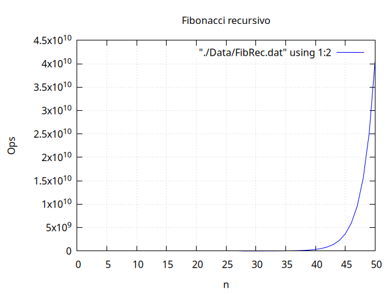
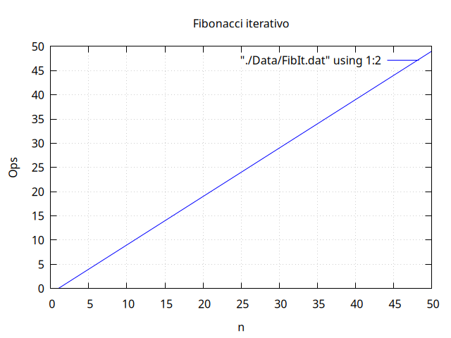
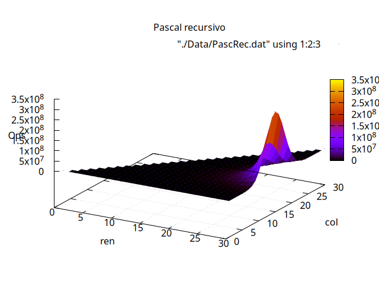
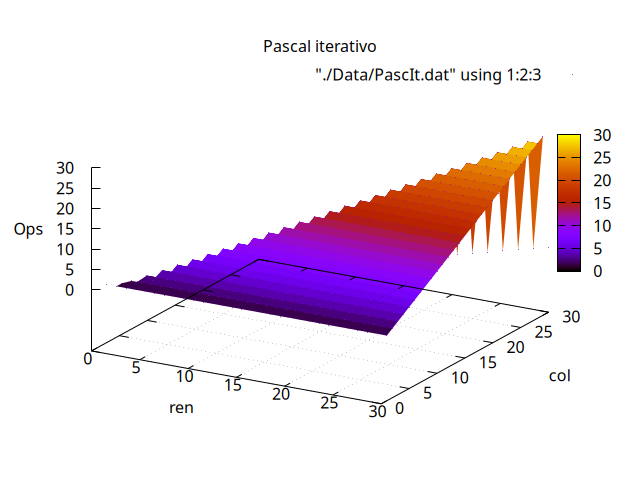

[](https://classroom.github.com/online_ide?assignment_repo_id=15552547&assignment_repo_type=AssignmentRepo)

# Práctica 1: Análisis de Complejidad Algorítmica

**Estructuras de Datos - UNAM**

> Análisis comparativo de complejidad temporal entre implementaciones recursivas e iterativas de algoritmos clásicos: Serie de Fibonacci y Triángulo de Pascal.

---

## Tabla de Contenidos

- [Descripción](#descripción)
- [Estructura del Proyecto](#estructura-del-proyecto)
- [Tecnologías](#tecnologías)
- [Instalación y Configuración](#instalación-y-configuración)
- [Uso](#uso)
- [Resultados](#resultados)
- [Análisis de Complejidad](#análisis-de-complejidad)
- [Entregas](#entregas)

---

## Descripción

Este proyecto implementa y analiza la complejidad computacional de dos algoritmos fundamentales en ciencias de la computación:

- **Serie de Fibonacci**: Cálculo del n-ésimo término
- **Triángulo de Pascal**: Cálculo del elemento en la fila `i`, columna `j`

Cada algoritmo cuenta con **dos implementaciones**:
1. **Versión Recursiva**: Implementación directa de la definición matemática
2. **Versión Iterativa**: Implementación optimizada usando bucles

El proyecto incluye un sistema de conteo de operaciones que permite comparar empíricamente la eficiencia de cada enfoque.

---

## Estructura del Proyecto

```
practica-1-complejidad/
├── Complejidad/                    # Biblioteca principal
│   ├── Complejidad.cs             # Implementaciones de algoritmos
│   ├── Interfaces.cs              # Interfaces del proyecto
│   └── Complejidad.csproj
│
├── ComplejidadMain/               # Proyecto ejecutable
│   ├── Main.cs                    # Programa principal con benchmarks
│   └── ComplejidadMain.csproj
│
├── ComplejidadNPruebas/           # Suite de pruebas unitarias
│   ├── UnitTestComplejidad.cs    # Tests para todos los métodos
│   ├── Calificador.cs            # Sistema de calificación
│   └── ComplejidadNPruebas.csproj
│
├── Data/                          # Datos de rendimiento
│   ├── FibIt.dat                 # Fibonacci iterativo
│   ├── FibRec.dat                # Fibonacci recursivo
│   ├── PascIt.dat                # Pascal iterativo
│   └── PascRec.dat               # Pascal recursivo
│
├── Img/                           # Gráficas de análisis
│   ├── FibIt.png                 # Gráfica Fibonacci iterativo
│   ├── FibRec.png                # Gráfica Fibonacci recursivo
│   ├── PascIt.png                # Gráfica Pascal iterativo
│   └── PascRec.png               # Gráfica Pascal recursivo
│
├── ReportePractica.md             # Reporte en Markdown
├── ReportePractica.html           # Reporte en HTML
├── ReportePractica.pdf            # Reporte en PDF
└── README.md                      # Este archivo
```

---

## Tecnologías

- **.NET 8.0+** - Framework de desarrollo
- **C#** - Lenguaje de programación
- **xUnit** - Framework de pruebas unitarias
- **gnuplot** - Generación de gráficas (opcional)

---

## Instalación y Configuración

### Prerrequisitos

```bash
# Verificar instalación de .NET
dotnet --version
# Debe mostrar versión 8.0 o superior
```

### Clonar y Compilar

```bash
# Compilar todo el proyecto
dotnet build

# Compilar solo la biblioteca
cd Complejidad && dotnet build

# Compilar solo el ejecutable
cd ComplejidadMain && dotnet build
```

---

## Uso

### Ejecutar Pruebas Unitarias

```bash
# Desde el directorio raíz
dotnet test ComplejidadNPruebas/ComplejidadNPruebas.csproj

# Con detalles verbose
dotnet test ComplejidadNPruebas/ComplejidadNPruebas.csproj --verbosity detailed
```

### Ejecutar el Programa Principal

```bash
# Generar datos de rendimiento y análisis
dotnet run --project ComplejidadMain/ComplejidadMain.csproj
```

El programa principal:
- Calcula valores de Fibonacci (recursivo e iterativo)
- Calcula valores del Triángulo de Pascal (recursivo e iterativo)
- Genera archivos `.dat` con los datos de rendimiento
- Muestra estadísticas en consola

### Generar Gráficas (Opcional)

Si tienes `gnuplot` instalado:

```bash
# Los comandos están documentados en el PDF de la práctica
gnuplot
# Luego ejecutar los comandos para cada gráfica
```

---

## Resultados

### Complejidad Temporal Observada

| Algoritmo | Implementación | Complejidad | Comportamiento |
|-----------|---------------|-------------|----------------|
| Fibonacci | Recursiva | O(2ⁿ) | Crecimiento exponencial |
| Fibonacci | Iterativa | O(n) | Crecimiento lineal |
| Pascal | Recursiva | O(2ⁿ) | Crecimiento exponencial |
| Pascal | Iterativa | O(n) | Crecimiento lineal |

### Valores Máximos Calculados

**Fibonacci Recursivo:**
- Valor máximo calculado: `n = 80`
- Tiempo aproximado: 10-15 minutos
- Observación: A partir de n=35 el tiempo aumenta drásticamente

**Triángulo de Pascal Recursivo:**
- Fila máxima calculada: `ren = 70`
- Tiempo aproximado: 20 minutos
- Observación: Los valores centrales requieren más operaciones

---

## Análisis de Complejidad

### Serie de Fibonacci

#### Implementación Recursiva - O(2ⁿ)

Las implementaciones recursivas realizan **trabajo duplicado**:

```csharp
FibonacciRec(n-1) + FibonacciRec(n-2)
```

Esto genera un árbol de llamadas donde muchos subproblemas se calculan múltiples veces.



**Figura 1:** Complejidad exponencial del algoritmo Fibonacci recursivo. Se observa un crecimiento acelerado en el número de operaciones conforme aumenta n.

#### Implementación Iterativa - O(n)

Las implementaciones iterativas calculan cada valor **una sola vez**:

```csharp
for(int i=1; i<n; i++) {
    current = low + fast;
    // ...
}
```

Cada iteración realiza un número constante de operaciones, resultando en O(n).



**Figura 2:** Complejidad lineal del algoritmo Fibonacci iterativo. El número de operaciones crece proporcionalmente con n.

---

### Triángulo de Pascal

#### Implementación Recursiva - O(2ⁿ)

Similar al caso de Fibonacci, la implementación recursiva realiza llamadas duplicadas:

```csharp
TPascalRecAux(ren-1, col-1) + TPascalRecAux(ren-1, col)
```

El crecimiento es exponencial, especialmente para elementos centrales del triángulo.



**Figura 3:** Complejidad exponencial del Triángulo de Pascal recursivo. Los valores centrales requieren significativamente más operaciones.

#### Implementación Iterativa - O(n)

La implementación iterativa usa un único bucle con fórmula combinatoria directa:

```csharp
for (int i = 1; i <= col; i++) {
    number = number * (ren - i + 1) / i;
    contador++;
}
```



**Figura 4:** Complejidad lineal del Triángulo de Pascal iterativo. Crecimiento controlado y proporcional a la columna.

---

### Conclusiones del Análisis

Las gráficas demuestran claramente que:

1. **Implementaciones Recursivas**: Presentan complejidad exponencial O(2ⁿ), con tiempos de ejecución que crecen dramáticamente
2. **Implementaciones Iterativas**: Mantienen complejidad lineal O(n), significativamente más eficientes
3. **Diferencia Práctica**: Para valores moderados de n, las versiones iterativas son órdenes de magnitud más rápidas

**Nota:** Para un análisis detallado con preguntas y justificaciones teóricas, consulta `ReportePractica.pdf`

---

## Entregas

### Primera Entrega
- [x] Implementación de Fibonacci (recursivo e iterativo)
- [x] Implementación de Triángulo de Pascal (recursivo e iterativo)
- [x] Pruebas unitarias completas
- [x] Sistema de conteo de operaciones

### Segunda Entrega
- [x] Generación de datos de rendimiento
- [x] Gráficas de análisis
- [x] Reporte completo con análisis
- [x] Respuestas a preguntas teóricas

---

## Observaciones Importantes

> **IMPORTANTE:** Está prohibido publicar las soluciones en repositorios públicos

- Las pruebas unitarias deben pasar al 100%
- Los archivos de datos se generan automáticamente al ejecutar el programa
- Las gráficas pueden regenerarse con gnuplot usando los archivos `.dat`
- El reporte está disponible en múltiples formatos: Markdown, HTML y PDF

---

## Autor

**Luis Fernando Nuñez Rangel**  
Estructuras de Datos - UNAM  
Facultad de Ciencias

---

## Licencia

Este proyecto es parte de material académico de la UNAM.  
Ver archivo `LICENSE` para más detalles.
