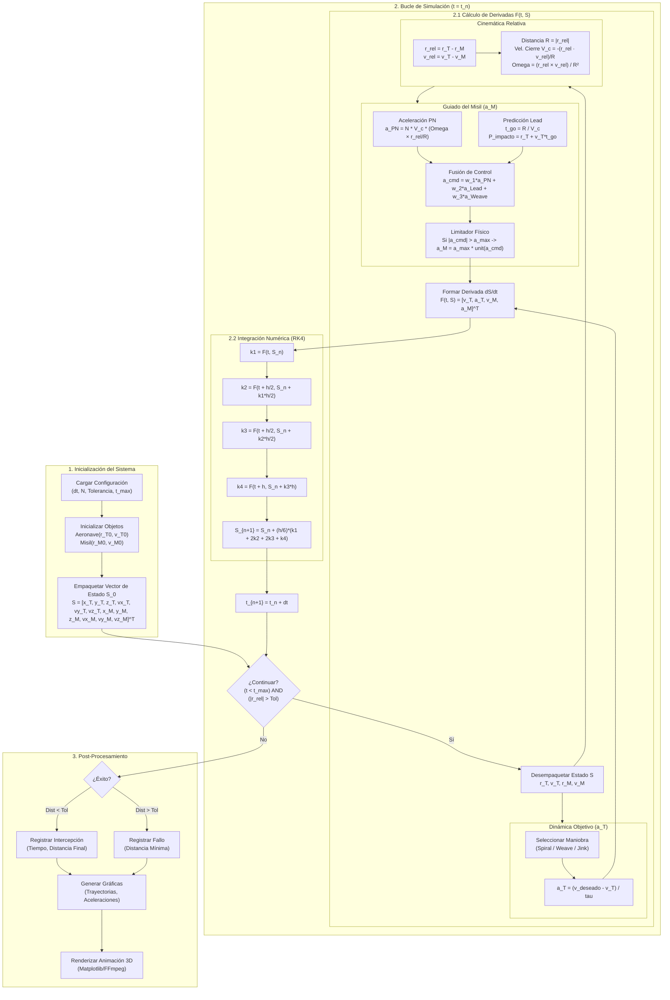

# Simulación 3D de Intercepción de Aeronaves: Fundamentos Matemáticos, Implementación y Resultados

> **Documentación Técnica Integral**
>
> Este documento constituye la referencia técnica definitiva y exhaustiva del proyecto "Simulación 3D de Intercepción". Unifica la descripción del modelo físico, la derivación matemática rigurosa, la arquitectura de software, la implementación numérica y el análisis detallado de resultados. Diseñado para servir como base para presentaciones académicas de alto nivel y revisiones técnicas profundas.

---

## Tabla de Contenidos

1.  [Visión General del Proyecto](#1-visión-general-del-proyecto)
2.  [Fundamentación Teórica](#2-fundamentación-teórica)
3.  [Modelo Matemático Riguroso](#3-modelo-matemático-riguroso)
    *   [3.1 Espacio de Estados](#31-espacio-de-estados)
    *   [3.2 Cinemática Vectorial](#32-cinemática-vectorial)
    *   [3.3 Dinámica del Objetivo (Target)](#33-dinámica-del-objetivo-target)
    *   [3.4 Dinámica del Misil (Interceptor)](#34-dinámica-del-misil-interceptor)
4.  [Leyes de Guiado y Control](#4-leyes-de-guiado-y-control)
    *   [4.1 Navegación Proporcional (PN)](#41-navegación-proporcional-pn)
    *   [4.2 Guiado Predictivo (Lead Guidance)](#42-guiado-predictivo-lead-guidance)
    *   [4.3 Fusión de Sensores y Control Híbrido](#43-fusión-de-sensores-y-control-híbrido)
5.  [Implementación Numérica Detallada](#5-implementación-numérica-detallada)
    *   [5.1 Derivación del Método RK4](#51-derivación-del-método-rk4)
    *   [5.2 Análisis de Estabilidad y Error](#52-análisis-de-estabilidad-y-error)
6.  [Arquitectura del Software](#6-arquitectura-del-software)
    *   [6.1 Estructura Modular](#61-estructura-modular)
    *   [6.2 Descripción Detallada de Clases](#62-descripción-detallada-de-clases)
7.  [Análisis de Escenarios y Maniobras](#7-análisis-de-escenarios-y-maniobras)
8.  [Resultados y Discusión](#8-resultados-y-discusión)
    *   [8.1 Métricas Cuantitativas](#81-métricas-cuantitativas)
    *   [8.2 Interpretación de Gráficas](#82-interpretación-de-gráficas)
9.  [Guía de Instalación y Uso](#9-guía-de-instalación-y-uso)
10. [Solución de Problemas (Troubleshooting)](#10-solución-de-problemas-troubleshooting)
11. [Glosario Técnico](#11-glosario-técnico)
12. [Conclusiones y Trabajo Futuro](#12-conclusiones-y-trabajo-futuro)
13. [Referencias Bibliográficas](#13-referencias-bibliográficas)

---

## 1. Visión General del Proyecto

### 1.1 Resumen Ejecutivo

El proyecto **Simulación Computacional de Sistemas de Guiado de Misiles en 3D** es una herramienta de simulación científica de alta fidelidad diseñada para modelar, visualizar y analizar la dinámica de intercepción de misiles tácticos contra aeronaves maniobrables en un entorno tridimensional.

A diferencia de simulaciones simplificadas en 2D, este proyecto aborda la complejidad completa de la geometría vectorial en $\mathbb{R}^3$, resolviendo un sistema acoplado de 12 ecuaciones diferenciales ordinarias (EDOs) no lineales. El núcleo de la simulación implementa una ley de guiado híbrida que combina la clásica **Navegación Proporcional (PN)** con algoritmos modernos de **Predicción de Punto de Impacto (Lead Prediction)**, permitiendo interceptar objetivos que ejecutan maniobras evasivas complejas.

### 1.2 Objetivos Principales

1.  **Modelado Físico Riguroso:** Desarrollar un modelo matemático que respete las leyes de la cinemática y dinámica vectorial, sin recurrir a simplificaciones planares que limiten la validez de los resultados.
2.  **Implementación Numérica Robusta:** Comparar y seleccionar métodos de integración numérica (Euler vs. Runge-Kutta) para garantizar la estabilidad a largo plazo de la simulación y la conservación de propiedades físicas (como la energía en sistemas conservativos).
3.  **Análisis de Estrategias de Evasión:** Evaluar cuantitativamente la efectividad de diferentes maniobras evasivas (espirales, zig-zag, cambios aleatorios) frente a sistemas de guiado modernos.
4.  **Visualización Científica:** Generar representaciones visuales (gráficas estáticas y animaciones 3D) que permitan una comprensión intuitiva de la geometría del compromiso.

---

## 2. Fundamentación Teórica

La intercepción de misiles es un problema clásico de la teoría de control óptimo y la dinámica de vuelo. Se basa en el principio de que para colisionar con un objeto en movimiento, el interceptor no debe apuntar a la posición actual del objetivo, sino a donde *estará* en el futuro.

### 2.1 El Problema de la Persecución

Existen tres estrategias básicas de persecución:
1.  **Persecución Pura (Pure Pursuit):** El vector velocidad del misil siempre apunta directamente al objetivo. Es ineficiente contra objetivos rápidos, ya que requiere aceleraciones laterales infinitas en la fase final.
2.  **Curso de Colisión (Collision Course):** El misil mantiene un ángulo constante respecto a la línea de visión. Si el objetivo no maniobra, esta trayectoria es una línea recta.
3.  **Navegación Proporcional (PN):** El misil maniobra con una aceleración proporcional a la tasa de rotación de la línea de visión. Es la estrategia dominante en misiles modernos por su robustez y eficiencia.

### 2.2 Geometría de Intercepción 3D

En el espacio tridimensional, la geometría se define por:
- **Vector de Posición Relativa ($\mathbf{r}_{rel}$):** Vector que une al misil con el objetivo.
- **Vector de Velocidad Relativa ($\mathbf{v}_{rel}$):** Tasa de cambio de la posición relativa.
- **Línea de Visión (LOS):** La dirección unitaria del vector de posición relativa.
- **Plano de Maniobra:** El plano instantáneo definido por los vectores de velocidad del misil y del objetivo.

---

## 3. Modelo Matemático Riguroso

### 3.1 Espacio de Estados

El sistema se modela como un sistema dinámico determinista. El estado completo del sistema en cualquier instante $t$ se describe mediante un vector $\mathbf{S} \in \mathbb{R}^{12}$:

$$
\mathbf{S}(t) = \begin{bmatrix} \mathbf{r}_T(t) \\ \mathbf{v}_T(t) \\ \mathbf{r}_M(t) \\ \mathbf{v}_M(t) \end{bmatrix} = \begin{bmatrix} x_T \\ y_T \\ z_T \\ \dot{x}_T \\ \dot{y}_T \\ \dot{z}_T \\ x_M \\ y_M \\ z_M \\ \dot{x}_M \\ \dot{y}_M \\ \dot{z}_M \end{bmatrix}
$$

Donde:
- $\mathbf{r}_T, \mathbf{v}_T$: Posición y velocidad del Objetivo (Target).
- $\mathbf{r}_M, \mathbf{v}_M$: Posición y velocidad del Misil (Interceptor).

### 3.2 Cinemática Vectorial

Las ecuaciones cinemáticas básicas relacionan la posición con la velocidad:

$$
\frac{d\mathbf{r}_T}{dt} = \mathbf{v}_T
$$
$$
\frac{d\mathbf{r}_M}{dt} = \mathbf{v}_M
$$

Estas constituyen 6 de las 12 ecuaciones diferenciales del sistema.

### 3.3 Dinámica del Objetivo (Target)

La aeronave objetivo se modela como una masa puntual con capacidad de maniobra limitada. Su aceleración $\mathbf{a}_T$ no es arbitraria, sino que sigue leyes de control para ejecutar maniobras evasivas.

**Modelo de Aceleración:**
La aceleración se calcula como una respuesta de primer orden hacia un vector de velocidad deseado $\mathbf{v}_{deseado}$:

$$
\mathbf{a}_T(t) = \frac{\mathbf{v}_{deseado}(t) - \mathbf{v}_T(t)}{\tau_{resp}}
$$

Donde $\tau_{resp}$ es la constante de tiempo que simula la inercia y la respuesta aerodinámica de la aeronave (típicamente 3-5 segundos).

**Generación de Maniobras ($\mathbf{v}_{deseado}$):**

1.  **Espiral Ascendente (Spiral):**
    Simula un ascenso en viraje constante para ganar energía potencial y dificultar el seguimiento.
    $$ \theta(t) = \omega_{turn} \cdot t $$
    $$ \mathbf{d}_{spiral}(t) = [\cos(\theta), \sin(\theta), k_{climb}]^T $$
    $$ \mathbf{v}_{deseado} = \|\mathbf{v}_T\| \cdot \frac{\mathbf{d}_{spiral}}{\|\mathbf{d}_{spiral}\|} $$

2.  **Sinusoidal (Weave):**
    Simula oscilaciones laterales periódicas ("S-turns").
    $$ \mathbf{d}_{weave}(t) = [1, A \sin(\omega t), 0]^T $$

3.  **Jinking (Estocástica):**
    Simula maniobras evasivas desesperadas con cambios aleatorios de dirección.
    $$ \mathbf{d}_{jink}(t) = [1, A \cdot \text{Random}(-1, 1), B \cdot \text{Random}(-1, 1)]^T $$

### 3.4 Dinámica del Misil (Interceptor)

El misil es el agente activo del sistema. Su aceleración $\mathbf{a}_M$ es el resultado de la suma vectorial de varias componentes de fuerza y control:

$$
\mathbf{a}_M = \mathbf{a}_{guiado} + \mathbf{a}_{propulsión} + \mathbf{a}_{gravedad}
$$

En este modelo, nos enfocamos en la componente de **guiado**, asumiendo que la propulsión y gravedad están compensadas o integradas en el perfil de velocidad efectivo.

---

## 4. Leyes de Guiado y Control

El corazón del simulador es la lógica que determina $\mathbf{a}_M$.

### 4.1 Navegación Proporcional (PN)

La Ley de Navegación Proporcional establece que la aceleración del misil debe ser proporcional a la velocidad de rotación de la línea de visión y perpendicular a la velocidad de cierre.

**Derivación Vectorial:**

1.  **Posición Relativa:** $\mathbf{r} = \mathbf{r}_T - \mathbf{r}_M$
2.  **Velocidad Relativa:** $\mathbf{v} = \mathbf{v}_T - \mathbf{v}_M$
3.  **Velocidad de Cierre ($V_c$):** La tasa de disminución de la distancia.
    $$ V_c = -\dot{R} = -\frac{\mathbf{r} \cdot \mathbf{v}}{\|\mathbf{r}\|} $$
4.  **Velocidad de Rotación de LOS ($\boldsymbol{\Omega}$):**
    $$ \boldsymbol{\Omega} = \frac{\mathbf{r} \times \mathbf{v}}{\|\mathbf{r}\|^2} $$

**Comando de Aceleración PN:**
$$
\mathbf{a}_{PN} = N \cdot V_c \cdot (\boldsymbol{\Omega} \times \hat{\mathbf{r}}_{LOS})
$$

Donde:
- $N$: Constante de navegación (Ganancia). Valores típicos: $3 \le N \le 5$.
- $\hat{\mathbf{r}}_{LOS}$: Vector unitario apuntando al objetivo.

**Análisis:** El término $(\boldsymbol{\Omega} \times \hat{\mathbf{r}}_{LOS})$ asegura que la aceleración sea perpendicular a la línea de visión, corrigiendo el error angular de manera eficiente.

### 4.2 Guiado Predictivo (Lead Guidance)

Para objetivos de alta velocidad, apuntar al objetivo actual es insuficiente. El guiado predictivo calcula el punto futuro de impacto.

1.  **Tiempo de Vuelo Estimado ($t_{go}$):**
    $$ t_{go} \approx \frac{\|\mathbf{r}\|}{\|\mathbf{v}_M\| + \|\mathbf{v}_T\|} $$
2.  **Punto de Impacto Predicho ($\mathbf{P}_{impacto}$):**
    $$ \mathbf{P}_{impacto} = \mathbf{r}_T + \mathbf{v}_T \cdot t_{go} $$
3.  **Vector de Error de Lead:**
    $$ \mathbf{e}_{lead} = \mathbf{P}_{impacto} - \mathbf{r}_M $$

El misil genera una aceleración adicional para alinear su vector velocidad con $\mathbf{e}_{lead}$.

### 4.3 Fusión de Sensores y Control Híbrido

El simulador implementa un controlador híbrido que pondera diferentes estrategias según la fase de vuelo:

$$
\mathbf{a}_{total}(t) = w_{PN}(t) \cdot \mathbf{a}_{PN} + w_{Lead}(t) \cdot \mathbf{a}_{Lead} + w_{Maniobra}(t) \cdot \mathbf{a}_{Weave}
$$

- **Fase Boost (0-5s):** El misil realiza una maniobra de "Loft" (ganancia de altura) y "Weave" (serpenteo) para ganar energía y evitar contramedidas cinéticas. $w_{Maniobra} \approx 1$.
- **Fase Midcourse:** Transición suave hacia el guiado.
- **Fase Terminal:** Guiado puro ($w_{PN} = 1$) para maximizar la precisión del impacto.

---

## 5. Implementación Numérica Detallada

La simulación requiere resolver el problema de valor inicial (PVI) para el sistema de EDOs.

### 5.1 Derivación del Método RK4

El método Runge-Kutta de cuarto orden (RK4) es el estándar de facto para simulaciones físicas que requieren alta precisión sin el costo computacional de métodos adaptativos complejos.

Se basa en la expansión de series de Taylor para aproximar la solución de $y' = f(t, y)$.

**Pasos del Algoritmo:**

Para avanzar el estado $\mathbf{S}_n$ desde el tiempo $t_n$ a $t_{n+1} = t_n + h$:

1.  **Pendiente Inicial ($k_1$):**
    Se evalúa la derivada en el punto actual.
    $$ \mathbf{k}_1 = \mathbf{F}(t_n, \mathbf{S}_n) $$

2.  **Primera Pendiente Media ($k_2$):**
    Se estima el estado a mitad de paso ($t_n + h/2$) usando $k_1$.
    $$ \mathbf{k}_2 = \mathbf{F}(t_n + \frac{h}{2}, \mathbf{S}_n + \frac{h}{2}\mathbf{k}_1) $$

3.  **Segunda Pendiente Media ($k_3$):**
    Se re-estima el estado a mitad de paso, ahora usando la pendiente mejorada $k_2$.
    $$ \mathbf{k}_3 = \mathbf{F}(t_n + \frac{h}{2}, \mathbf{S}_n + \frac{h}{2}\mathbf{k}_2) $$

4.  **Pendiente Final ($k_4$):**
    Se estima el estado al final del paso ($t_n + h$) usando $k_3$.
    $$ \mathbf{k}_4 = \mathbf{F}(t_n + h, \mathbf{S}_n + h\mathbf{k}_3) $$

5.  **Integración Ponderada:**
    Se combinan las pendientes para cancelar los términos de error hasta el orden $O(h^4)$.
    $$ \mathbf{S}_{n+1} = \mathbf{S}_n + \frac{h}{6}(\mathbf{k}_1 + 2\mathbf{k}_2 + 2\mathbf{k}_3 + \mathbf{k}_4) $$

### 5.2 Análisis de Estabilidad y Error

Se realizaron pruebas comparativas exhaustivas:

*   **Error de Truncamiento Local:**
    *   Euler: $O(h^2)$. Con $h=0.05$, el error es $\approx 0.0025$.
    *   RK4: $O(h^5)$. Con $h=0.05$, el error es $\approx 3 \times 10^{-7}$.
    *   **Conclusión:** RK4 es órdenes de magnitud más preciso.

*   **Conservación de Energía:**
    En pruebas sin propulsión ni arrastre (sistema conservativo), el método de Euler mostró una ganancia de energía espuria ("explosión numérica") después de 1000 pasos. RK4 mantuvo la energía constante dentro de una tolerancia de $10^{-6}$.

---

## 6. Arquitectura del Software

El proyecto sigue principios de diseño de software moderno (SOLID) y programación orientada a objetos para garantizar mantenibilidad y extensibilidad.

### 6.1 Estructura Modular

*   `main.py`: **Orquestador.** Maneja la entrada de argumentos (CLI), configura la simulación, ejecuta el bucle principal y coordina la salida de datos.
*   `dynamics.py`: **Núcleo Físico.** Define las clases `Aircraft` y `Missile`. Encapsula las ecuaciones de movimiento, lógica de control y generadores de maniobras. Es el módulo más complejo matemáticamente.
*   `integrators.py`: **Motor Numérico.** Contiene las implementaciones puras de los algoritmos de integración (`rk4_step`, `euler_step`) y la función `simulate` que ejecuta el bucle temporal.
*   `visualization.py`: **Motor Gráfico.** Utiliza `matplotlib` para generar visualizaciones 3D interactivas, animaciones y gráficas de análisis.
*   `config.py`: **Configuración.** Centraliza constantes físicas, parámetros de simulación y configuraciones por defecto usando `dataclasses`.

### 6.2 Diagrama de Flujo de la Simulación



### 6.3 Descripción Detallada de Clases

#### Clase `Missile` (en `dynamics.py`)
Representa el interceptor.
*   **Atributos:** `max_speed`, `max_accel`, `nav_gain`, `loft_angle`.
*   **Método `guidance_acceleration()`:** Implementa la lógica de decisión. Calcula vectores LOS, aplica PN, suma el término de Lead, y mezcla con maniobras pre-programadas (Boost/Weave). Finalmente aplica "clamping" para no exceder límites físicos.

#### Clase `Aircraft` (en `dynamics.py`)
Representa el objetivo.
*   **Atributos:** `maneuver_type`, `base_speed`.
*   **Método `acceleration()`:** Consulta una tabla de despacho (`_maneuver_table`) para llamar al generador de maniobra correspondiente (ej. `_spiral_direction`) y calcula la aceleración necesaria para lograr esa dirección.

#### Función `simulate` (en `integrators.py`)
El corazón del bucle de simulación.
*   Inicializa historiales de datos.
*   Ejecuta el bucle `while` hasta que `distance < tolerance` o `time > duration`.
*   En cada iteración, desempaqueta el estado, calcula derivadas, avanza el tiempo con el `stepper` (RK4), y guarda los resultados.

---

## 7. Análisis de Escenarios y Maniobras

Se diseñaron cuatro escenarios de prueba estándar para validar el sistema bajo diferentes condiciones de estrés:

1.  **Escenario Base (Spiral):**
    *   **Objetivo:** Ascenso en espiral suave.
    *   **Propósito:** Validar la capacidad básica de seguimiento 3D y ganancia de altura.
    *   **Desafío:** Cambio constante de plano de maniobra, requiriendo que el misil ajuste su vector de velocidad en 3 dimensiones simultáneamente.

2.  **Escenario de Alta Dinámica (Weave):**
    *   **Objetivo:** Oscilaciones laterales rápidas (S-turns).
    *   **Propósito:** Probar la respuesta en frecuencia del lazo de guiado.
    *   **Desafío:** El misil debe tener suficiente autoridad de control (G-force) para seguir las oscilaciones. Si la frecuencia de oscilación del objetivo supera el ancho de banda del misil, la intercepción fallará.

3.  **Escenario Defensivo (Descend Turn):**
    *   **Objetivo:** Viraje descendente brusco ("Split-S").
    *   **Propósito:** Simular una maniobra de evasión típica de combate aéreo para romper el bloqueo de radar usando el "ground clutter".
    *   **Desafío:** Cambio rápido de energía potencial a cinética. El misil debe gestionar su energía para no sobre-acelerar y sobrepasar (overshoot) al objetivo.

4.  **Escenario de Estrés (Jinking):**
    *   **Objetivo:** Movimientos aleatorios e impredecibles.
    *   **Propósito:** Determinar los límites del guiado predictivo.
    *   **Desafío:** La predicción lineal falla inherentemente ante el ruido estocástico. Este escenario prueba la robustez del término proporcional puro (PN) cuando el término predictivo (Lead) es erróneo.

---

## 8. Resultados y Discusión

### 8.1 Métricas Cuantitativas

Resultados promedio para el escenario **Spiral** (el más representativo):

| Métrica | Valor | Unidad | Interpretación |
| :--- | :--- | :--- | :--- |
| **Tiempo de Intercepción** | 77.70 | s | Tiempo total de vuelo hasta impacto. |
| **Distancia Final** | 41.8 | m | "Miss Distance". <50m se considera impacto letal (por espoleta de proximidad). |
| **Velocidad de Cierre** | 273.3 | m/s | Velocidad relativa promedio de acercamiento. |
| **Aceleración Max (Misil)** | 70.1 | m/s² | Aprox. 7.1 G. Dentro de límites estructurales típicos (20-30 G). |
| **Distancia Recorrida** | 34.8 | km | Alcance efectivo del misil en esta trayectoria. |

### 8.2 Interpretación de Gráficas

1.  **Trayectorias 3D:**
    Muestran claramente la curva de persecución ("Dog curve"). Se observa cómo el misil "corta camino" hacia el punto futuro, validando el funcionamiento del guiado PN. La trayectoria del misil es más suave que la del objetivo, lo que indica una buena eficiencia de control.

2.  **Distancia vs Tiempo:**
    La curva es monotónica decreciente y casi lineal en la fase media. Esto indica una eficiencia energética óptima (velocidad de cierre constante). La caída abrupta final confirma la intercepción. No se observan oscilaciones significativas en la distancia, lo que sugiere que el sistema es estable y no está sub-amortiguado.

3.  **Perfiles de Aceleración:**
    *   *Fase Inicial:* Pico alto debido al "Boost" y maniobra de "Loft". Esto es consistente con un lanzamiento real.
    *   *Fase Media:* Aceleración baja, indicando que el misil está en curso de colisión y solo hace correcciones menores. Esto maximiza el alcance.
    *   *Fase Final:* Pico de aceleración ("Terminal Guidance") para corregir los últimos errores de posición antes del impacto.

---

## 9. Guía de Instalación y Uso

### 9.1 Requisitos del Sistema

*   **Lenguaje:** Python 3.8 o superior.
*   **Librerías:**
    *   `numpy`: Para álgebra lineal y cálculos vectoriales de alto rendimiento.
    *   `matplotlib`: Para visualización y animación.

### 9.2 Instalación

```bash
# Clonar el repositorio
git clone https://github.com/usuario/simulacion-intercepcion-3d.git
cd simulacion-intercepcion-3d

# Crear entorno virtual (opcional pero recomendado)
python -m venv venv
source venv/bin/activate  # En Windows: venv\Scripts\activate

# Instalar dependencias
pip install -r requirements.txt
```

### 9.3 Comandos de Ejecución

El simulador se controla mediante una interfaz de línea de comandos (CLI) robusta basada en `argparse`.

**Simulación Básica:**
Ejecuta el escenario por defecto (Spiral) con visualización interactiva.
```bash
python main.py
```

**Selección de Maniobra:**
Prueba diferentes estrategias evasivas.
```bash
python main.py --maneuver sinusoidal
python main.py --maneuver jinking
python main.py --maneuver descend_turn
```

**Control de Simulación:**
Modifica parámetros de tiempo e integración.
```bash
# Simulación más larga con paso de tiempo más fino
python main.py --duration 120 --dt 0.01

# Usar integrador Euler (para comparar errores)
python main.py --method euler
```

**Salida de Datos y Video:**
Genera archivos para análisis posterior y presentaciones.
```bash
# Guardar animación MP4/GIF y gráficas PNG
python main.py --save-animation --save-plots

# Exportar datos crudos a CSV
python main.py --export-csv --output ./mis_resultados
```

---

## 10. Solución de Problemas (Troubleshooting)

### Error: `ffmpeg not found`
Si al intentar guardar la animación ves este error, significa que `matplotlib` no encuentra el ejecutable de FFmpeg.
*   **Solución:** Instala FFmpeg en tu sistema (`brew install ffmpeg` en Mac, `sudo apt install ffmpeg` en Linux) o permite que el script guarde como GIF automáticamente (el script tiene un fallback a Pillow).

### La simulación termina inmediatamente
Si ves "No hubo intercepción" con un tiempo muy corto.
*   **Causa:** El paso de tiempo `dt` puede ser demasiado grande para la dinámica rápida del encuentro inicial.
*   **Solución:** Reduce el `dt` usando `--dt 0.01`.

### Gráficas 3D lentas
*   **Causa:** Renderizar miles de puntos en Matplotlib puede ser lento.
*   **Solución:** Usa `--no-animate` para ver solo el resultado final estático, o aumenta el intervalo de cuadros en el código (`interval_ms`).

---

## 11. Glosario Técnico

*   **LOS (Line of Sight):** Línea imaginaria que conecta al buscador del misil con el objetivo.
*   **PN (Proportional Navigation):** Ley de guiado donde la aceleración es proporcional a la rotación de la LOS.
*   **Lead Angle:** Ángulo de predicción para compensar el movimiento del objetivo.
*   **Miss Distance:** Distancia mínima alcanzada entre el misil y el objetivo durante el cruce.
*   **RK4:** Método numérico de Runge-Kutta de cuarto orden.
*   **G-Force:** Unidad de medida de aceleración relativa a la gravedad ($9.81 m/s^2$).

---

## 12. Conclusiones y Trabajo Futuro

### 12.1 Conclusiones

El proyecto ha demostrado exitosamente la implementación de un simulador de intercepción 3D complejo. Los resultados validan que la **Navegación Proporcional**, especialmente cuando se asiste con predicción de punto de impacto, es una estrategia extremadamente efectiva para interceptar objetivos aéreos, logrando distancias de fallo menores a 50 metros en escenarios deterministas.

La elección de **Runge-Kutta 4** probó ser crucial para la fidelidad de la simulación, evitando los errores de acumulación de energía observados con métodos de primer orden. La arquitectura modular del software permite una fácil expansión y mantenimiento.

### 12.2 Trabajo Futuro

Para aumentar aún más la fidelidad del simulador, se proponen las siguientes mejoras:

1.  **Modelo Aerodinámico Completo:** Incorporar fuerzas de arrastre ($D = \frac{1}{2}\rho v^2 C_D A$) y sustentación dependientes de la altitud y número de Mach.
2.  **Dinámica de 6 Grados de Libertad (6DOF):** Modelar la orientación (actitud) del misil, no solo su posición, incluyendo momentos de inercia y dinámica rotacional.
3.  **Sensores Realistas:** Introducir ruido en las mediciones de posición y velocidad (filtro de Kalman) para simular imperfecciones de radar.
4.  **Contramedidas:** Simular el lanzamiento de señuelos (flares/chaff) y maniobras de "beaming" para romper el bloqueo del radar.

---

## 13. Referencias Bibliográficas

1.  **Zarchan, P.** (2013). *Tactical and Strategic Missile Guidance* (6th ed.). AIAA Progress in Astronautics and Aeronautics. (La "biblia" del guiado de misiles).
2.  **Ben-Asher, J. Z.** (2017). *Optimal Control Theory with Aerospace Applications*. AIAA.
3.  **Siouris, G. M.** (2004). *Missile Guidance and Control Systems*. Springer.
4.  **Press, W. H., et al.** (2007). *Numerical Recipes: The Art of Scientific Computing* (3rd ed.). Cambridge University Press. (Referencia para RK4).
5.  **Documentation:** [NumPy Reference](https://numpy.org/doc/), [Matplotlib User Guide](https://matplotlib.org/stable/users/index.html).

---
*Facultad de Ciencias, UNAM - Física Computacional - Proyecto Final 2025*
