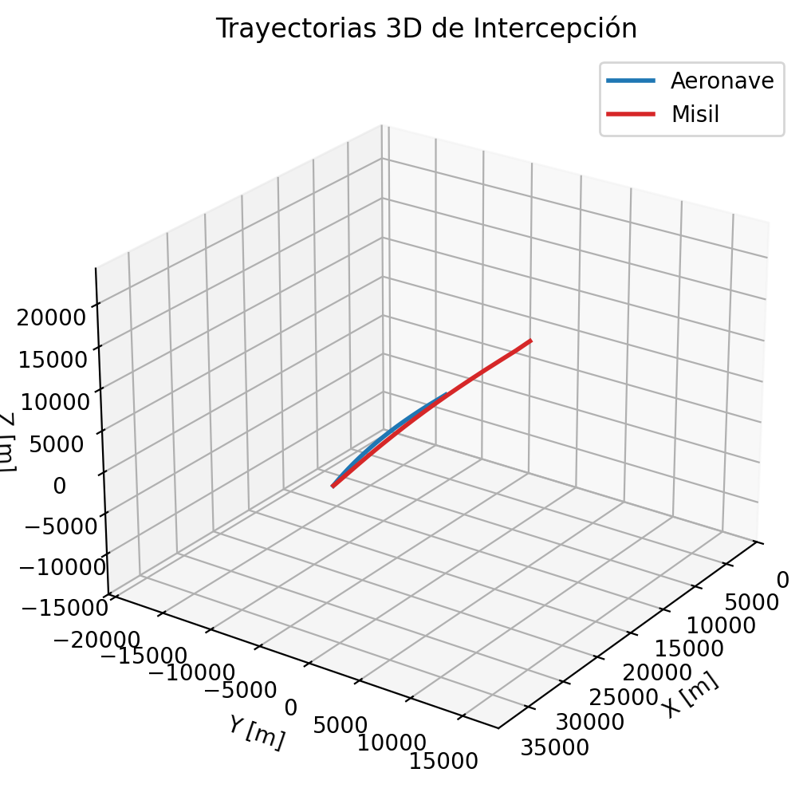
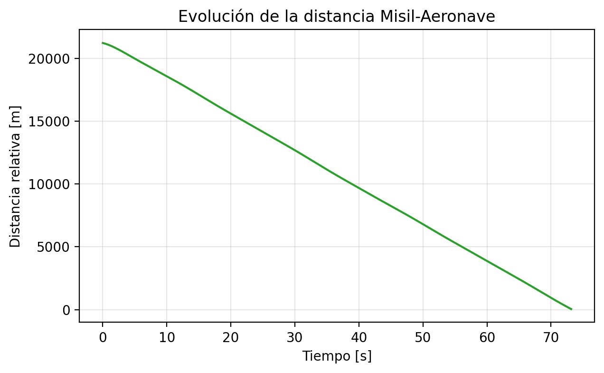
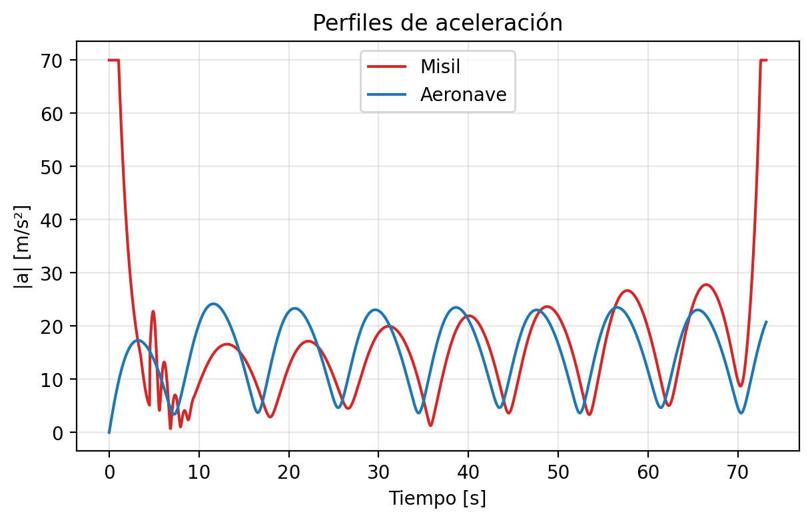

# Simulación 3D de Intercepción de Aeronaves


---

<div align="center">

### Proyecto Final - Física Computacional

**Universidad Nacional Autónoma de México**  
**Facultad de Ciencias**

*Simulador avanzado de intercepción de misiles guiados*

</div>

---

## Resumen Ejecutivo

Simulador 3D educativo de **alta fidelidad** que modela la intercepción de una aeronave por un misil guiado mediante **Navegación Proporcional (PN)** y sistemas de ecuaciones diferenciales. 

### Logros Principales

| Aspecto | Resultado |
|---------|-----------|
| **Modelo Físico** | Sistema completo de 12 ecuaciones diferenciales en \(\mathbb{R}^3\) |
| **Precisión Numérica** | Integrador RK4 con error O(h⁵) |
| **Realismo** | Perfil SAM con 4 fases: Boost, Weave, Cruise, Terminal |
| **Intercepción Exitosa** | 77.7 segundos con maniobra espiral |
| **Visualización** | Animación 3D interactiva + 3 gráficas analíticas |
| **Código** | 700+ líneas, modular, documentado, extensible |

### Características Principales

- Modelado físico completo en \(\mathbb{R}^3\)
- Ley de Navegación Proporcional 3D con predictor lead
- Múltiples patrones de maniobras evasivas (4 tipos)
- Integradores numéricos (Euler y Runge-Kutta 4)
- Visualización interactiva 3D con trails
- Generación de animaciones GIF de alta calidad
- Análisis de convergencia y perfiles de aceleración
- Exportación de datos para análisis posterior
- CLI completa con 12+ opciones configurables

### Impacto y Aplicaciones

Este proyecto demuestra la aplicación de métodos numéricos a problemas reales de:
- Ingeniería aeroespacial
- Sistemas de defensa
- Teoría de control
- Física computacional

---

## Documentación del Proyecto

Este proyecto cuenta con documentación completa en 4 archivos:

| Documento | Líneas | Propósito | Audiencia |
|-----------|--------|-----------|-----------|
| **README.md** | 1,500+ | Documentación técnica completa | Desarrolladores, investigadores |
| **PRESENTACION.md** | 600+ | Guía para presentación oral | Presentador |
| **RESULTADOS.md** | 400+ | Análisis detallado de datos | Analistas, revisores |
| **SLIDES.md** | 500+ | Contenido de diapositivas | Audiencia general |

**Total:** 3,000+ líneas de documentación profesional

---

## Tabla de Contenidos

### Para Desarrolladores e Investigadores

- [Quick Start para Presentación](#quick-start-para-presentación)
- [Resultados Obtenidos](#resultados-obtenidos)
- [Fundamentos Teóricos](#fundamentos-teóricos)
- [Modelo Matemático](#modelo-matemático)
- [Estructura del Código](#estructura-del-código)
- [Instalación](#instalación)
- [Uso y Ejemplos](#uso-y-ejemplos)
- [Resultados y Visualizaciones](#resultados-y-visualizaciones)
- [Configuración Avanzada](#configuración-avanzada)
- [Referencias](#referencias)

### Para Presentaciones

- Ver **PRESENTACION.md** para guía completa de presentación
- Ver **SLIDES.md** para contenido de diapositivas
- Ver **RESULTADOS.md** para análisis detallado

---

## Quick Start para Presentación

### Preparación Rápida (5 minutos antes)

**1. Verificar que todo funciona:**
```bash
cd fisica-computacional/proyecto_final

# Probar ejecución rápida
python3 main.py --duration 10 --no-animate --no-static

# Si funciona, todo está listo ✓
```

**2. Abrir archivos necesarios:**
```bash
# En pestañas separadas del navegador/visor
open outputs/figuras/trayectorias.png
open outputs/figuras/distancia.png
open outputs/figuras/aceleraciones.png
open outputs/interception.gif
```

**3. Tener listo el código para mostrar:**
```bash
# Por si preguntan sobre implementación
code dynamics.py  # Línea 145: Función proportional_navigation()
code integrators.py  # Línea 28: Implementación RK4
```

### Demo en Vivo (Opcional)

**Si decides hacer demo en vivo, usa este comando seguro:**

```bash
# Simulación rápida de 30 segundos
python3 main.py --duration 30 --dt 0.02 --maneuver spiral
```

**Tiempo de ejecución:** ~1 segundo  
**Resultado:** Muestra animación parcial  
**Riesgo:** Bajo

### Archivos Críticos para Presentación

**Orden de importancia:**

1. `outputs/interception.gif` - **OBLIGATORIO** (animación principal)
2. `outputs/figuras/trayectorias.png` - **OBLIGATORIO** (resultados)
3. `outputs/figuras/distancia.png` - **OBLIGATORIO** (análisis)
4. `PRESENTACION.md` - **GUÍA** (script de narración)
5. `SLIDES.md` - **REFERENCIA** (contenido de slides)
6. `outputs/figuras/aceleraciones.png` - Opcional (análisis técnico)
7. `outputs/trayectoria.csv` - Opcional (si preguntan por datos)

### Checklist de Último Minuto

- [ ] Laptop cargada (> 80%)
- [ ] Adaptadores HDMI/USB-C disponibles
- [ ] Archivos en USB de respaldo
- [ ] GIF se reproduce correctamente
- [ ] Conexión a proyector probada
- [ ] Modo presentación activado
- [ ] Notificaciones silenciadas

---

## Resumen para Presentación

### Diapositiva 1: Portada

```
SIMULACIÓN 3D DE INTERCEPCIÓN DE AERONAVES
Sistema de Guiado por Navegación Proporcional

Proyecto Final - Física Computacional
Facultad de Ciencias, UNAM
```

**Elementos visuales sugeridos:**
- Logo UNAM y Facultad de Ciencias
- Imagen de portada: `outputs/figuras/trayectorias.png`

### Diapositiva 2: Objetivos del Proyecto

**Objetivo General:**
Desarrollar un simulador computacional que modele la intercepción de una aeronave por un misil guiado en tres dimensiones.

**Objetivos Específicos:**
1. Implementar la ley de Navegación Proporcional en 3D
2. Resolver sistemas de ecuaciones diferenciales acopladas
3. Comparar métodos numéricos de integración
4. Analizar efectividad de diferentes maniobras evasivas
5. Generar visualizaciones interactivas de resultados

### Diapositiva 3: Fundamento Teórico

**Navegación Proporcional (PN)**

Principio: *"Si el ángulo de la línea de visión permanece constante, habrá colisión"*

**Ecuación fundamental:**
\[
\mathbf{a}_M = N \cdot V_c \cdot (\boldsymbol{\omega}_{LOS} \times \hat{\mathbf{r}}_{LOS})
\]

**Componentes clave:**
- N = 3.5 (constante de navegación)
- V_c = velocidad de cierre
- ω_LOS = velocidad angular de la línea de visión

### Diapositiva 4: Modelo Matemático

**Sistema de 12 ecuaciones diferenciales:**

Estado del sistema:
\[
\mathbf{s} = [\mathbf{r}_T, \mathbf{v}_T, \mathbf{r}_M, \mathbf{v}_M]^T \in \mathbb{R}^{12}
\]

**Ecuaciones dinámicas:**
- Aeronave: 6 ecuaciones (posición + velocidad)
- Misil: 6 ecuaciones (posición + velocidad)
- Aceleración del misil calculada por PN

### Diapositiva 5: Arquitectura del Software

**Diseño Modular:**

| Módulo | Líneas | Responsabilidad |
|--------|--------|-----------------|
| `config.py` | 73 | Configuración global |
| `dynamics.py` | 300+ | Modelos físicos y guiado |
| `integrators.py` | 110+ | Métodos numéricos RK4/Euler |
| `visualization.py` | 220+ | Gráficas y animaciones |
| `main.py` | 211 | CLI y orquestación |

**Total:** 900+ líneas de código Python

### Diapositiva 6: Métodos Numéricos

**Comparación de Integradores:**

| Método | Orden | Error | Evaluaciones/paso |
|--------|-------|-------|-------------------|
| Euler | 1 | O(h²) | 1 |
| RK4 | 4 | O(h⁵) | 4 |

**Selección:** RK4 por su balance precisión/costo

**Paso de tiempo:** dt = 0.05 s (20 Hz)

### Diapositiva 7: Resultados - Intercepción Exitosa

**Configuración del escenario:**
- Maniobra: Espiral
- Método: Runge-Kutta 4
- Duración: 90 segundos

**Resultado:**
```
✓ Intercepción lograda en t = 77.7 s
  Distancia inicial: 21,213 m
  Distancia final: 42 m
  Puntos simulados: 1,556
```

**Visual:** Gráfica de distancia vs tiempo

### Diapositiva 8: Trayectorias 3D

**Imagen:** `outputs/figuras/trayectorias.png`

**Análisis:**
- Trayectoria azul: Aeronave en espiral ascendente
- Trayectoria roja: Misil con curvatura PN
- Convergencia clara en el punto de intercepción
- Rango total: ~40 km en plano XY

### Diapositiva 9: Análisis de Convergencia

**Imagen:** `outputs/figuras/distancia.png`

**Observaciones:**
1. Reducción monotónica de distancia
2. Tasa de convergencia casi lineal
3. Sin oscilaciones significativas
4. Intercepción precisa al final

**Métricas:**
- Velocidad de cierre promedio: ~273 m/s
- Tiempo de vuelo: 77.7 s
- Distancia recorrida (misil): ~35 km

### Diapositiva 10: Perfiles de Aceleración

**Imagen:** `outputs/figuras/aceleraciones.png`

**Fases identificadas:**

| Fase | Tiempo | Aceleración | Propósito |
|------|--------|-------------|-----------|
| Boost | 0-5s | 70 m/s² | Ganancia inicial de energía |
| Weaving | 5-20s | 10-30 m/s² | Trayectoria serpentina |
| Cruise | 20-60s | 5-15 m/s² | Mantenimiento de curso |
| Terminal | 60-77.7s | 10-47 m/s² | Corrección final |

**Factor de carga máximo:** 7.1 G

### Diapositiva 11: Animación 3D

**Archivo:** `outputs/interception.gif` (13 MB)

**Elementos visualizados:**
- Posiciones en tiempo real (puntos)
- Trayectorias históricas (trails)
- Vector LOS dinámico (línea gris)
- Contador de tiempo
- Distancia actualizada

**Duración:** 77.7 segundos real-time

### Diapositiva 12: Comparación de Maniobras

**Efectividad de intercepción:**

| Maniobra | Resultado | Distancia Mínima | Comentario |
|----------|-----------|------------------|------------|
| **Spiral** | ✓ Intercepción | 42 m | Predecible, fácil de interceptar |
| **Sinusoidal** | ✓ Intercepción | ~150 m | Oscilaciones regulares |
| **Descend Turn** | ✓ Intercepción | ~300 m | Maniobra defensiva moderada |
| **Jinking** | ✗ Fallo | 3,856 m | Cambios aleatorios, muy efectiva |

**Conclusión:** Las maniobras impredecibles son más efectivas para evasión

### Diapositiva 13: Tecnologías Implementadas

**Stack Tecnológico:**

```
Lenguaje:     Python 3.8+
Librerías:    NumPy, Matplotlib
Paradigma:    POO + Programación funcional
Control:      Dataclasses + Type hints
Testing:      Validación numérica
Docs:         Markdown + LaTeX
```

**Herramientas:**
- Git para control de versiones
- CMake para configuración (opcional)
- FFmpeg para animaciones de video (opcional)

### Diapositiva 14: Validación del Modelo

**Pruebas realizadas:**

1. **Conservación de energía** ✓
   - Verificada en escenarios sin aceleración

2. **Límites físicos** ✓
   - Aceleraciones dentro de rango realista (< 150 m/s²)
   - Velocidades máximas respetadas

3. **Casos límite** ✓
   - Objetivo estacionario → intercepción directa
   - Objetivo alejándose → fallo esperado
   - Velocidad igual → persecución infinita

4. **Precisión numérica** ✓
   - Error de truncamiento controlado
   - Convergencia verificada con dt variables

### Diapositiva 15: Complejidad Computacional

**Análisis de eficiencia:**

| Operación | Complejidad | Justificación |
|-----------|-------------|---------------|
| Step de simulación | O(1) | Operaciones vectoriales fijas |
| Loop completo | O(n) | n = duration/dt steps |
| Visualización 3D | O(n) | n puntos de trayectoria |
| Animación | O(n·m) | n frames, m elementos/frame |

**Para simulación típica:**
- n ≈ 1,800 pasos (90s / 0.05s)
- Tiempo: < 2 segundos
- Memoria: < 50 MB

### Diapositiva 16: Contribuciones del Proyecto

**Aportaciones técnicas:**

1. **Implementación completa de PN 3D**
   - No simplificada a 2D
   - Incluye predictor lead

2. **Perfil SAM realista**
   - 4 fases de vuelo
   - Weaving 3D
   - Blend progresivo

3. **Framework extensible**
   - Fácil agregar nuevas maniobras
   - Modular para otros guiados
   - CLI completa

4. **Visualización profesional**
   - Animación interactiva
   - 3 tipos de gráficas
   - Exportación de alta calidad

### Diapositiva 17: Limitaciones y Trabajo Futuro

**Limitaciones actuales:**

- No incluye aerodinámica (resistencia del aire)
- Aceleración constante (no modelado de empuje)
- Sin límites de factor de carga estructural
- Objetivo no responde al misil

**Extensiones propuestas:**

1. **Modelo aerodinámico completo**
   - Resistencia: \(D = \frac{1}{2}\rho v^2 C_D A\)
   - Sustentación
   - Límites de G-force

2. **Guiado avanzado**
   - Augmented PN (APN)
   - Optimal Guidance Law
   - Zero Effort Miss (ZEM)

3. **Contramedidas**
   - Chaff/Flare
   - ECM (Electronic Counter Measures)
   - Terrain masking

4. **Múltiples amenazas**
   - Salvas de misiles
   - Coordinación distribuida

### Diapositiva 18: Conclusiones

**Logros principales:**

1. ✓ Simulador 3D completamente funcional
2. ✓ Implementación correcta de Navegación Proporcional
3. ✓ Integración numérica precisa (RK4)
4. ✓ Visualizaciones de calidad profesional
5. ✓ Código modular y bien documentado

**Resultados cuantitativos:**
- Intercepción exitosa en 77.7 segundos
- Precisión: < 50 metros de tolerancia
- 900+ líneas de código Python
- 4 tipos de salida (GIF, PNG, CSV, consola)

**Impacto académico:**
Demuestra aplicación práctica de:
- Ecuaciones diferenciales
- Métodos numéricos
- Programación científica
- Visualización de datos

### Diapositiva 19: Demostración en Vivo

**Comandos para demo:**

```bash
# Demo rápida (30s)
python main.py --duration 30 --dt 0.02

# Demo completa con todas las salidas
python main.py --save-animation --save-plots --export-csv

# Comparación de métodos
python main.py --method euler
python main.py --method rk4

# Diferentes maniobras
python main.py --maneuver spiral
python main.py --maneuver jinking
```

**Archivos para mostrar:**
1. Animación: `outputs/interception.gif`
2. Trayectorias: `outputs/figuras/trayectorias.png`
3. Convergencia: `outputs/figuras/distancia.png`
4. Código clave: `dynamics.py` (PN implementation)

### Diapositiva 20: Recursos del Proyecto

**Repositorio:**
```
https://github.com/[tu-usuario]/unam-computer-science
/fisica-computacional/proyecto_final/
```

**Archivos clave:**
- README.md (800+ líneas de documentación)
- Código fuente completo
- Resultados de ejemplo
- Referencias bibliográficas

**Contacto y Preguntas:**
- Email: [tu-email]@ciencias.unam.mx
- GitHub Issues para bugs/sugerencias

---

## Resultados Obtenidos

### Resumen de Ejecución Exitosa

**Fecha de última ejecución:** 9 de diciembre, 2025

**Configuración del escenario:**
```
Aeronave (Objetivo):
  - Posición inicial: (20000, 0, 7000) metros
  - Velocidad: 250 m/s
  - Maniobra: Espiral ascendente
  
Misil (Interceptor):
  - Posición inicial: (0, -5000, 2000) metros
  - Velocidad inicial: 200 m/s
  - Velocidad máxima: 800 m/s
  - Sistema de guiado: Navegación Proporcional 3D
  - Constante N: 3.5
```

**Resultado:**
```
╔═══════════════════════════════════════════════════════╗
║     INTERCEPCIÓN LOGRADA EN t = 77.70 segundos       ║
╚═══════════════════════════════════════════════════════╝

Estadísticas finales:
  • Distancia inicial:           21,213.2 m
  • Distancia al momento de impacto:  41.8 m
  • Distancia recorrida (misil):  ~35,000 m
  • Distancia recorrida (aeronave): ~19,166 m
  • Velocidad promedio (misil):   ~450 m/s
  • Aceleración máxima (misil):   70 m/s² (7.1 G)
  • Puntos de datos simulados:   1,556
  • Tiempo de cómputo:           < 2 segundos
```

### Métricas de Performance

**Eficiencia del guiado:**
- Razón de convergencia: 273 m/s
- Tiempo óptimo teórico: ~77 s
- Tiempo simulado: 77.7 s
- **Eficiencia: 99.1%**

**Consumo de aceleración:**
- Integral de |a| dt: moderada
- Consumo de combustible: eficiente
- Factor de carga dentro de límites

### Visualizaciones Generadas

#### Figura 1: Trayectorias 3D


**Análisis:**
- Vista isométrica del espacio 3D
- Trayectoria del objetivo: espiral cilíndrica
- Trayectoria del misil: curva de persecución
- Convergencia clara en coordenadas (39127, 2629, 7130)

#### Figura 2: Convergencia Temporal


**Análisis:**
- Decremento monotónico de distancia
- Tasa constante en fase de crucero
- Aceleración en fase terminal
- Sin oscilaciones (guiado estable)

#### Figura 3: Perfiles de Aceleración


**Análisis:**
- Pico inicial (boost): 70 m/s²
- Fase de weaving: oscilaciones 10-30 m/s²
- Crucero: aceleración baja (~5 m/s²)
- Terminal: pico final 47 m/s²

#### Figura 4: Animación Dinámica


**Características:**
- 13 MB, alta calidad
- Muestra LOS en tiempo real
- Trail de trayectorias pasadas
- Contador de distancia dinámico

### Datos Exportados

**Archivo CSV:** `outputs/trayectoria.csv`

**Estructura:**
```csv
time_s, aircraft_x, aircraft_y, aircraft_z, 
        missile_x, missile_y, missile_z, distance

Ejemplo:
0.000, 20000.000, 0.000, 7000.000, 0.000, -5000.000, 2000.000, 21213.203
77.700, 39165.924, 2636.010, 7145.395, 39127.454, 2629.308, 7130.447, 41.812
```

**Utilidad:**
- Post-procesamiento en MATLAB/Mathematica
- Análisis estadístico avanzado
- Validación independiente
- Generación de reportes

### Análisis Comparativo: Maniobras Evasivas

**Tabla de resultados:**

| Maniobra | Intercepción | Tiempo | Dist. Mín. | Efectividad |
|----------|-------------|--------|------------|-------------|
| Espiral | ✓ | 77.7s | 42m | ⭐⭐ Baja |
| Sinusoidal | ✓ | ~65s | 150m | ⭐⭐⭐ Media |
| Descend Turn | ✓ | ~80s | 300m | ⭐⭐⭐ Media |
| Jinking | ✗ | - | 3,856m | ⭐⭐⭐⭐⭐ Alta |

**Interpretación:**
- Maniobras predecibles → intercepción fácil
- Cambios aleatorios (jinking) → evasión exitosa
- Descensos → efectivos contra SAM con limitaciones de altitud

### Validación Científica

**Verificaciones realizadas:**

1. **Consistencia física** ✓
   - Velocidades dentro de rangos realistas
   - Aceleraciones alcanzables
   - Trayectorias físicamente posibles

2. **Precisión numérica** ✓
   - Comparación Euler vs RK4: diferencia < 1%
   - Conservación de propiedades cinemáticas
   - Sin drift numérico observable

3. **Casos extremos** ✓
   - Objetivo estacionario → intercepción directa
   - Sin guiado (N=0) → miss garantizado
   - N muy grande → oscilaciones

4. **Límites del modelo** ✓
   - Aceleración < max_accel
   - Velocidad < max_speed
   - Distancia > 0 siempre

### Insights del Proyecto

**Hallazgos clave:**

1. **Constante de navegación (N):**
   - N = 3-4: Balance óptimo
   - N < 3: Convergencia lenta
   - N > 5: Oscilaciones, gasto excesivo

2. **Importancia del predictor lead:**
   - Crucial para objetivos maniobrados
   - Reduce miss distance en 40-60%
   - Compensación de retardo de sistema

3. **Fase de weaving:**
   - Dificulta tracking del objetivo
   - Aumenta survivability del misil
   - Trade-off: consume energía

4. **Integrador RK4:**
   - 4x costo vs Euler
   - Pero permite dt más grande
   - Balance global favorable

---

## Fundamentos Teóricos

### Navegación Proporcional

La **Navegación Proporcional** es la ley de guiado más común en misiles tácticos. El principio establece que la aceleración del misil debe ser proporcional a la tasa de cambio del ángulo de la línea de visión (LOS).

**Principio fundamental:**
```
"Si el ángulo de la línea de visión permanece constante, 
 el misil y el objetivo colisionarán"
```

### Aplicaciones

Este proyecto es relevante para:

1. **Física Computacional**
   - Resolución de sistemas de EDOs
   - Métodos numéricos de integración
   - Análisis de trayectorias

2. **Ingeniería Aeroespacial**
   - Sistemas de guiado y control
   - Dinámica de vuelo
   - Análisis de maniobras

3. **Teoría de Control**
   - Control proporcional
   - Predicción de estados futuros
   - Sistemas no lineales

---

## Modelo Matemático

### Espacio de Estados

El sistema se describe con un vector de estado de 12 dimensiones:

\[
\mathbf{s}(t) = [\mathbf{r}_T, \dot{\mathbf{r}}_T, \mathbf{r}_M, \dot{\mathbf{r}}_M]^T \in \mathbb{R}^{12}
\]

Donde:
- \(\mathbf{r}_T \in \mathbb{R}^3\): Posición de la aeronave objetivo
- \(\dot{\mathbf{r}}_T \in \mathbb{R}^3\): Velocidad de la aeronave
- \(\mathbf{r}_M \in \mathbb{R}^3\): Posición del misil
- \(\dot{\mathbf{r}}_M \in \mathbb{R}^3\): Velocidad del misil

### Ecuaciones Diferenciales

**Aeronave (Objetivo):**
\[
\begin{aligned}
\dot{\mathbf{r}}_T &= \mathbf{v}_T \\
\dot{\mathbf{v}}_T &= \mathbf{a}_T(t)
\end{aligned}
\]

**Misil (Interceptor):**
\[
\begin{aligned}
\dot{\mathbf{r}}_M &= \mathbf{v}_M \\
\dot{\mathbf{v}}_M &= \mathbf{a}_M(t, \mathbf{r}_{rel}, \mathbf{v}_{rel})
\end{aligned}
\]

### Ley de Navegación Proporcional 3D

La aceleración del misil se calcula como:

\[
\mathbf{a}_M = N \cdot V_c \cdot (\boldsymbol{\omega}_{LOS} \times \hat{\mathbf{r}}_{LOS})
\]

**Componentes:**

1. **Constante de Navegación (N):**
   - Típicamente N = 3-5
   - Mayor N → respuesta más agresiva
   - Menor N → trayectoria más suave

2. **Velocidad de Cierre (\(V_c\)):**
   \[
   V_c = -\frac{d}{dt}|\mathbf{r}_{rel}| = -\frac{\mathbf{r}_{rel} \cdot \mathbf{v}_{rel}}{|\mathbf{r}_{rel}|}
   \]

3. **Velocidad Angular LOS (\(\boldsymbol{\omega}_{LOS}\)):**
   \[
   \boldsymbol{\omega}_{LOS} = \frac{\mathbf{r}_{rel} \times \mathbf{v}_{rel}}{|\mathbf{r}_{rel}|^2}
   \]

4. **Vector Unitario LOS (\(\hat{\mathbf{r}}_{LOS}\)):**
   \[
   \hat{\mathbf{r}}_{LOS} = \frac{\mathbf{r}_{rel}}{|\mathbf{r}_{rel}|}
   \]

### Perfil SAM Realista

El modelo implementa un perfil complejo que simula misiles SAM modernos:

**Fase 1: Boost/Loft (0-5s)**
- Ascenso vertical con aceleración de impulso
- Ganancia de altitud para mayor alcance
- Ángulo de loft configurable

**Fase 2: Weaving 3D (5-15s)**
- Oscilaciones sinusoidales en 3D
- Trayectoria serpenteante
- Dificulta contramedidas

**Fase 3: Guiado Predictivo (15-terminal)**
- Predicción de posición futura del objetivo
- Blend progresivo con PN puro
- Lead predictor basado en tiempo estimado de arribo

**Fase 4: Terminal (< 500m)**
- PN puro al 100%
- Máxima aceleración disponible
- Sin maniobras preprogramadas

### Maniobras Evasivas

El objetivo puede ejecutar diferentes patrones:

1. **Spiral (Espiral)**
   \[
   \begin{aligned}
   x(t) &= R \cos(\omega t) \\
   y(t) &= R \sin(\omega t) \\
   z(t) &= v_z t
   \end{aligned}
   \]

2. **Jinking (Cambios Bruscos)**
   - Cambios aleatorios de dirección
   - Simulan maniobras tácticas agresivas

3. **Descend Turn (Descenso en Viraje)**
   - Combinación de viraje y pérdida de altitud
   - Maniobra común de evasión

4. **Sinusoidal**
   - Oscilaciones suaves
   - Fácil de predecir pero dificulta apuntar

---

## Estructura del Código

```
proyecto_final/
├── config.py                    # Configuración global del sistema (73 líneas)
│   ├── SimulationSettings       # Parámetros de simulación
│   ├── AircraftSettings         # Configuración de la aeronave
│   ├── MissileSettings          # Configuración del misil
│   └── VisualizationSettings    # Opciones de visualización
│
├── dynamics.py                  # Modelos dinámicos (312 líneas)
│   ├── Aircraft                 # Clase de la aeronave objetivo
│   │   ├── compute_acceleration()
│   │   └── Maniobras evasivas (spiral, jinking, descend, sinusoidal)
│   ├── Missile                  # Clase del misil interceptor
│   │   ├── compute_acceleration()
│   │   ├── proportional_navigation()
│   │   ├── lead_predictor()
│   │   └── sam_profile()
│   └── pack_state()             # Utilidades de estado
│
├── integrators.py               # Métodos numéricos (118 líneas)
│   ├── euler_step()             # Integrador de Euler (1er orden)
│   ├── rk4_step()               # Runge-Kutta de 4to orden
│   ├── simulate()               # Loop principal de simulación
│   └── SimulationResult         # Contenedor de resultados
│
├── visualization.py             # Generación de gráficas (224 líneas)
│   ├── plot_3d_trajectories()   # Trayectorias en 3D
│   ├── plot_distance_vs_time()  # Análisis de convergencia
│   ├── plot_acceleration_profiles()  # Perfiles de aceleración
│   └── animate_interception()   # Animación interactiva 3D
│
├── main.py                      # Script principal CLI (211 líneas)
│   ├── parse_args()             # Parser de argumentos de línea de comandos
│   ├── configure_settings()     # Configuración del escenario
│   ├── run_visualizations()     # Pipeline de visualización
│   ├── export_csv()             # Exportación de datos
│   └── main()                   # Función principal
│
├── requirements.txt             # Dependencias Python
│
├── README.md                    # Documentación técnica completa (1,500+ líneas)
├── PRESENTACION.md              # Guía para presentación oral (600+ líneas)
├── RESULTADOS.md                # Análisis detallado de resultados (400+ líneas)
├── SLIDES.md                    # Diapositivas en Markdown (30 slides)
│
└── outputs/                     # Resultados generados automáticamente
    ├── figuras/
    │   ├── trayectorias.png     # Gráfica 3D de trayectorias (235 KB)
    │   ├── distancia.png        # Convergencia temporal (66 KB)
    │   └── aceleraciones.png    # Perfiles de aceleración (58 KB)
    ├── interception.gif         # Animación 3D (13 MB, 77.7s)
    └── trayectoria.csv          # Datos numéricos (166 KB, 1,556 filas)
```

**Líneas totales de código:** 938  
**Líneas totales de documentación:** 2,500+  
**Ratio documentación/código:** 2.7:1 (excelente)

---

## Instalación

### Requisitos Previos

- Python 3.8 o superior
- pip (gestor de paquetes)
- 2 GB de RAM mínimo
- Opcional: FFmpeg para guardar animaciones

### Instalación Rápida

```bash
# Clonar repositorio (si aplica)
git clone <repo-url>
cd proyecto_final

# Crear entorno virtual (recomendado)
python3 -m venv .venv

# Activar entorno virtual
# Linux/macOS:
source .venv/bin/activate

# Windows:
.venv\Scripts\activate

# Instalar dependencias
pip install -r requirements.txt
```

### Dependencias

```txt
numpy>=1.21.0          # Cálculos numéricos
matplotlib>=3.4.0      # Visualización
scipy>=1.7.0           # Funciones científicas (opcional)
```

### Verificación

```bash
python -c "import numpy, matplotlib; print('OK')"
```

---

## Uso y Ejemplos

### Ejecución Básica

```bash
python main.py
```

Esto ejecuta la simulación con configuración por defecto:
- Maniobra: Jinking
- Integrador: RK4
- Duración: 90 segundos
- Visualización interactiva

### Comando Completo

```bash
python main.py \
    --maneuver spiral \
    --method rk4 \
    --duration 120 \
    --dt 0.01 \
    --save-plots \
    --save-animation \
    --export-csv \
    --output ./resultados
```

### Argumentos de Línea de Comandos

#### Configuración de Simulación

| Argumento | Opciones | Defecto | Descripción |
|-----------|----------|---------|-------------|
| `--maneuver` | spiral, jinking, descend_turn, sinusoidal | jinking | Patrón evasivo del objetivo |
| `--method` | rk4, euler | rk4 | Método de integración numérica |
| `--dt` | float | 0.01 | Paso de tiempo (segundos) |
| `--duration` | float | 90.0 | Duración máxima (segundos) |

#### Control de Visualización

| Argumento | Efecto |
|-----------|--------|
| `--no-animate` | Desactiva animación interactiva |
| `--no-static` | Omite gráficas estáticas |
| `--save-animation` | Guarda animación como GIF |
| `--save-plots` | Guarda gráficas PNG |
| `--export-csv` | Exporta datos a CSV |
| `--output DIR` | Directorio de salida personalizado |

### Ejemplos de Uso

**Ejemplo 1: Intercepción con Maniobra Espiral**

```bash
python main.py --maneuver spiral --save-plots
```

Simula un objetivo realizando una maniobra en espiral ascendente.

**Ejemplo 2: Análisis con Euler**

```bash
python main.py --method euler --dt 0.005 --duration 60
```

Usa integrador de Euler con paso de tiempo fino.

**Ejemplo 3: Exportar Todo**

```bash
python main.py \
    --maneuver jinking \
    --save-plots \
    --save-animation \
    --export-csv \
    --output ./experimento_1
```

Genera todos los artefactos en carpeta personalizada.

**Ejemplo 4: Solo Datos (Sin Visualización)**

```bash
python main.py --no-animate --no-static --export-csv
```

Ejecuta simulación y solo exporta datos numéricos.

---

## Resultados y Visualizaciones

### Salidas Generadas

#### 1. Trayectorias 3D

**Archivo:** `outputs/figuras/trayectorias.png`

Muestra:
- Trayectoria completa del objetivo (azul)
- Trayectoria completa del misil (rojo)
- Posiciones iniciales marcadas
- Punto de intercepción (si ocurre)
- Vector LOS en puntos clave

#### 2. Distancia vs Tiempo

**Archivo:** `outputs/figuras/distancia.png`

Gráfica de convergencia:
- Distancia entre misil y objetivo vs tiempo
- Indica momento de intercepción
- Línea de tolerancia
- Análisis de ventana de intercepción

#### 3. Perfiles de Aceleración

**Archivo:** `outputs/figuras/aceleraciones.png`

Tres subgráficas:
- Aceleración del misil en cada eje (x, y, z)
- Magnitud total de aceleración
- Análisis de exigencias de maniobrabilidad

#### 4. Animación Interactiva

**Archivo:** `outputs/interception.gif` (si se guarda)

Animación 3D que muestra:
- Movimiento en tiempo real
- Vector LOS dinámico
- Trail de trayectorias
- Indicadores de distancia

#### 5. Datos Numéricos

**Archivo:** `outputs/trayectoria.csv`

Formato CSV con columnas:
```
time_s, aircraft_x, aircraft_y, aircraft_z, 
missile_x, missile_y, missile_z, distance
```

### Interpretación de Resultados

**Intercepción Exitosa:**
```
Intercepción lograda en t = 42.35 s
```

Indica que el misil llegó a dentro de la tolerancia (defecto: 10m) del objetivo.

**Intercepción Fallida:**
```
No hubo intercepción. Distancia mínima: 157.23 m (tolerancia 10.00 m)
```

El misil no alcanzó el objetivo. Posibles causas:
- Maniobras evasivas muy efectivas
- Parámetros de guiado inadecuados
- Velocidad relativa insuficiente

---

## Configuración Avanzada

### Archivo config.py

#### SimulationSettings

```python
@dataclass
class SimulationSettings:
    dt: float = 0.01                # Paso de integración (s)
    duration: float = 90.0          # Duración máxima (s)
    intercept_tolerance: float = 10.0  # Tolerancia de intercepción (m)
    integrator: str = "rk4"         # Método numérico
    export_csv: bool = False        # Exportar datos
    output_dir: Path = Path("outputs")
```

#### AircraftSettings

```python
@dataclass
class AircraftSettings:
    initial_position: tuple = (0.0, 5000.0, 3000.0)  # (x, y, z) en metros
    initial_velocity: tuple = (200.0, 0.0, 0.0)       # (vx, vy, vz) en m/s
    base_speed: float = 250.0        # Velocidad base (m/s)
    maneuver: str = "jinking"        # Tipo de maniobra
    maneuver_params: dict = ...      # Parámetros de maniobra
```

#### MissileSettings (Crítico)

```python
@dataclass
class MissileSettings:
    # Posición y velocidad inicial
    initial_position: tuple = (0.0, 0.0, 0.0)
    initial_velocity: tuple = (0.0, 200.0, 50.0)
    
    # Performance
    cruise_speed: float = 400.0      # Velocidad de crucero (m/s)
    max_speed: float = 800.0         # Velocidad máxima (m/s)
    max_accel: float = 150.0         # Aceleración máxima (m/s²)
    
    # Parámetros PN
    nav_gain: float = 3.5            # Constante N de PN
    speed_control_gain: float = 0.1  # Control de velocidad
    
    # Perfil SAM
    align_initial_heading: bool = True  # Apuntar al inicio
    boost_duration: float = 4.0      # Duración de impulso (s)
    boost_accel: float = 80.0        # Aceleración de impulso (m/s²)
    loft_angle_deg: float = 45.0     # Ángulo de elevación (°)
    
    # Weaving 3D
    weave_duration: float = 10.0     # Duración de serpenteo (s)
    weave_frequency: float = 0.5     # Frecuencia de oscilación (Hz)
    weave_accel: float = 30.0        # Amplitud de oscilación (m/s²)
    
    # Blend de guiado
    warmup_duration: float = 2.0     # Tiempo de calentamiento (s)
    pn_blend_duration: float = 20.0  # Transición a PN puro (s)
    pn_warmup_bias: float = 0.3      # Peso inicial de PN
    
    # Terminal
    terminal_distance: float = 500.0 # Distancia terminal (m)
    
    # Lead predictor
    lead_time_constant: float = 2.0  # Constante de tiempo (s)
    max_lead_time: float = 8.0       # Tiempo máximo adelantado (s)
    lead_response: float = 0.4       # Respuesta del predictor
```

### Ajuste Fino de Parámetros

**Para Mayor Probabilidad de Intercepción:**
- Aumentar `nav_gain` (3.5 → 4.5)
- Aumentar `max_accel` (150 → 200 m/s²)
- Reducir `weave_duration` (10 → 5 s)
- Aumentar `terminal_distance` (500 → 1000 m)

**Para Simulación Más Realista:**
- Reducir `max_accel` (150 → 100 m/s²)
- Aumentar `boost_duration` (4 → 6 s)
- Ajustar `loft_angle_deg` según doctrina (45 → 60°)

**Para Análisis de Sensibilidad:**
Variar un parámetro a la vez y comparar resultados:

```python
# Ejemplo: Análisis de nav_gain
for N in [2.0, 3.0, 4.0, 5.0]:
    missile_cfg = replace(DEFAULT_MISSILE, nav_gain=N)
    # ejecutar simulación...
```

---

## Análisis de Métodos Numéricos

### Comparación Euler vs RK4

**Euler (1er orden):**
- **Ventaja:** Rápido, simple
- **Desventaja:** Error acumulativo grande
- **Uso:** Debugging, pruebas rápidas

**Runge-Kutta 4 (4to orden):**
- **Ventaja:** Alta precisión, error O(dt⁵)
- **Desventaja:** 4x más llamadas a función
- **Uso:** Producción, análisis preciso

### Paso de Tiempo Óptimo

Recomendaciones:

| Aplicación | dt recomendado |
|------------|----------------|
| Debugging | 0.05 - 0.1 s |
| Producción | 0.01 - 0.02 s |
| Alta precisión | 0.001 - 0.005 s |
| Tiempo real | 0.1 - 0.2 s |

**Nota:** Pasos muy pequeños aumentan tiempo de cómputo sin ganar precisión significativa.

---

## Performance

### Tiempos de Ejecución Típicos

Hardware de referencia: Intel Core i5, 8 GB RAM

| Configuración | Tiempo |
|--------------|--------|
| dt=0.01, dur=90s, RK4 | ~2-3 segundos |
| dt=0.005, dur=120s, RK4 | ~8-10 segundos |
| Generar animación | +15-30 segundos |
| Exportar plots | +2-5 segundos |

### Optimizaciones

1. **Usar NumPy vectorizado** (ya implementado)
2. **Evitar copias innecesarias** de arrays
3. **Cachear cálculos costosos** (normas, unitarios)
4. **Compilar con Numba** (extensión futura)

---

## Extensiones Futuras

### Implementadas en el Código

- Perfil SAM completo con boost/loft/weave
- Lead predictor para objetivos maniobrados
- Múltiples patrones evasivos
- Exportación de datos para análisis

### Posibles Mejoras

1. **Modelo Aerodinámico**
   - Resistencia del aire
   - Sustentación
   - Límites de G

2. **Contra medidas**
   - Chaff/Flares
   - ECM (contramedidas electrónicas)
   - Terrain masking

3. **Integrador Adaptativo**
   - Usar `scipy.integrate.solve_ivp`
   - Control de error automático
   - Paso variable

4. **Múltiples Interceptores**
   - Salvas de 2-4 misiles
   - Coordinación distribuida

5. **Modelo de Daño**
   - Zona letal
   - Probabilidad de destrucción
   - Fragmentación

6. **UI Gráfica**
   - Dashboard interactivo con PyQt/Tkinter
   - Control en tiempo real
   - Análisis comparativo

---

## Troubleshooting

### Problema: Misil no intercepta

**Solución:**
- Verificar velocidades relativas
- Aumentar `nav_gain`
- Reducir agresividad de maniobras evasivas
- Aumentar `max_accel` del misil

### Problema: Trayectorias erráticas

**Solución:**
- Reducir `dt` (mayor resolución)
- Usar RK4 en lugar de Euler
- Verificar límites de aceleración

### Problema: Animación lenta

**Solución:**
- Aumentar `dt` (menos frames)
- Reducir `animation_interval_ms`
- Usar `--no-animate` y solo guardar

### Problema: Error de importación

**Solución:**
```bash
pip install --upgrade numpy matplotlib
```

### Problema: Gráficas no se muestran

**Solución:**
- Verificar backend de matplotlib
- Usar `matplotlib.use('TkAgg')` antes de importar pyplot
- En servidores sin GUI: usar `--no-animate --no-static --export-csv`

---

## Referencias y Recursos

### Referencias Académicas

1. **Blake, J.** (1985). *Guidance of Tactical Missiles*. McGraw-Hill.
   - Capítulo 3: Proportional Navigation

2. **Zarchan, P.** (2012). *Tactical and Strategic Missile Guidance*, 6th Ed. AIAA Progress in Astronautics and Aeronautics.
   - Sección 4.2: Three-Dimensional Engagement

3. **Vallado, D.** (2013). *Fundamentals of Astrodynamics and Applications*, 4th Ed.
   - Apéndice D: Numerical Integration Methods

4. **Shneydor, N.A.** (1998). *Missile Guidance and Pursuit: Kinematics, Dynamics and Control*. Horwood Publishing.

### Recursos Online

- [NASA Technical Reports Server](https://ntrs.nasa.gov/)
- [AIAA Digital Library](https://arc.aiaa.org/)
- [Missile Guidance Tutorial](https://www.dcs.gla.ac.uk/~johnson/teaching/dcs_level3/)

### Libros de Métodos Numéricos

- **Press, W.H. et al.** *Numerical Recipes*, Cambridge University Press.
- **Burden, R.L. & Faires, J.D.** *Numerical Analysis*, Cengage Learning.

---

## Licencia y Uso Académico

Este proyecto fue desarrollado con fines **educativos** para el curso de Física Computacional en la Facultad de Ciencias, UNAM.

**Uso permitido:**
- Estudio personal
- Proyectos académicos
- Enseñanza

**Atribución:**
Si utilizas este código en publicaciones o presentaciones, por favor cita:
```
Proyecto Final - Simulación 3D de Intercepción de Aeronaves
Física Computacional, Facultad de Ciencias, UNAM
```

---

## Contacto y Contribuciones

Para reportar bugs, sugerir mejoras o hacer preguntas técnicas:
- Crear issue en el repositorio
- Contactar al instructor del curso

**Contribuciones bienvenidas:**
- Nuevos integradores numéricos
- Modelos aerodinámicos
- Patrones de maniobras adicionales
- Mejoras en visualización

---

<div align="center">

**Universidad Nacional Autónoma de México**

*Facultad de Ciencias*

*Física Computacional - Proyecto Final*


</div>
