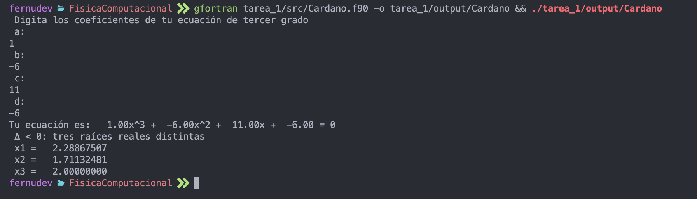

# Tarea 1: Métodos Numéricos Fundamentales

**Autor**: Luis Fernando Núñez Rangel  
**Institución**: Facultad de Ciencias, UNAM  
**Asignatura**: Física Computacional

## Descripción General

Esta tarea implementa dos algoritmos fundamentales del álgebra numérica utilizando Fortran 90. Los programas desarrollados resuelven problemas clásicos de matemáticas aplicadas con aplicaciones directas en física computacional.

## Contenido

### 1. Cardano.f90 - Resolución de Ecuaciones Cúbicas

#### Fundamento Teórico

El programa implementa la **Fórmula de Cardano** para resolver ecuaciones polinómicas de tercer grado de la forma:

```
a x³ + b x² + c x + d = 0
```

El método utiliza la transformación deprimida y el discriminante para clasificar las raíces:

**Discriminante**: Δ = q² + (4p³)/27

Donde:
- p = (3ac - b²)/(3a²)
- q = (2b³ - 9abc + 27a²d)/(27a³)

#### Casos de Solución

1. **Δ > 0**: Una raíz real y dos raíces complejas conjugadas
2. **Δ = 0**: Tres raíces reales, con al menos dos iguales (raíz múltiple)
3. **Δ < 0**: Tres raíces reales y distintas (caso irreducible)

#### Características Técnicas

- Manejo de aritmética compleja en Fortran
- Cálculo de raíces cúbicas de números complejos
- Interfaz interactiva por terminal
- Validación automática del tipo de raíces

#### Compilación y Ejecución

```bash
# Compilar el programa
gfortran src/Cardano.f90 -o output/Cardano

# Ejecutar
./output/Cardano
```

#### Ejemplo de Uso

```
Entrada:
  a = 1
  b = -6
  c = 11
  d = -6

Salida:
  Tu ecuación es: 1.00x^3 + -6.00x^2 + 11.00x + -6.00 = 0
  Δ < 0: tres raíces reales distintas
  x1 = 1.00000000
  x2 = 2.00000000
  x3 = 3.00000000
```

#### Casos de Prueba Documentados

- **Caso Δ > 0**:  11.19.53 p.m..png>)
- **Caso Δ = 0**:  11.18.23 p.m..png>)
- **Caso Δ < 0**: 

---

### 2. vectores.f90 - Operaciones con Vectores en R^n

#### Fundamento Teórico

Implementación de operaciones fundamentales del álgebra lineal en espacios vectoriales de dimensión arbitraria n.

#### Operaciones Implementadas

1. **Norma Euclidiana** (magnitud del vector):
   ```
   ||v|| = √(v₁² + v₂² + ... + vₙ²)
   ```

2. **Suma y Resta de Vectores**:
   ```
   v₁ ± v₂ = (v₁₁ ± v₂₁, v₁₂ ± v₂₂, ..., v₁ₙ ± v₂ₙ)
   ```

3. **Producto Escalar** (dot product):
   ```
   v₁ · v₂ = v₁₁v₂₁ + v₁₂v₂₂ + ... + v₁ₙv₂ₙ
   ```

4. **Ángulo entre Vectores**:
   ```
   θ = arccos(v₁ · v₂ / (||v₁|| ||v₂||))
   ```

5. **Producto Vectorial** (solo para n=3):
   ```
   v₁ × v₂ = (v₁₂v₂₃ - v₁₃v₂₂, v₁₃v₂₁ - v₁₁v₂₃, v₁₁v₂₂ - v₁₂v₂₁)
   ```

#### Características Técnicas

- Manejo dinámico de memoria con `allocatable`
- Subrutina interna para cálculo de norma
- Validación de dimensionalidad para producto vectorial
- Soporte para vectores de dimensión arbitraria

#### Compilación y Ejecución

```bash
# Compilar el programa
gfortran src/vectores.f90 -o output/vectores

# Ejecutar
./output/vectores
```

#### Ejemplo de Uso

```
Entrada:
  Dimensión N = 3
  Vector v1 = (1, 2, 3)
  Vector v2 = (4, 5, 6)

Salida:
  Norma de v1 = 3.74166
  Norma de v2 = 8.77496
  Vector suma = (5.0, 7.0, 9.0)
  Norma de la suma = 12.24745
  Vector resta = (-3.0, -3.0, -3.0)
  Norma de la resta = 5.19615
  Producto punto = 32.0
  Ángulo entre vectores (grados) = 12.93315
  Producto vectorial = (-3.0, 6.0, -3.0)
  Norma del producto vectorial = 7.34847
```

#### Salida Visual

 11.23.48 p.m..png>)

---

## Estructura del Directorio

```
tarea_1/
├── src/
│   ├── Cardano.f90          # Ecuaciones cúbicas por Cardano
│   └── vectores.f90         # Operaciones vectoriales
├── output/
│   ├── Cardano              # Ejecutable de ecuaciones cúbicas
│   └── vectores             # Ejecutable de vectores
├── *.png                    # Capturas de pantalla de resultados
└── README.md                # Esta documentación
```

## Requisitos del Sistema

### Compilador

- **gfortran** (GNU Fortran Compiler) versión 9.0 o superior
- Compatible con el estándar Fortran 90/95

### Instalación de gfortran

**macOS**:
```bash
brew install gcc
```

**Ubuntu/Debian**:
```bash
sudo apt-get install gfortran
```

**Fedora/RHEL**:
```bash
sudo dnf install gcc-gfortran
```

## Validación y Pruebas

### Cardano.f90

Se recomienda validar con ecuaciones conocidas:
- x³ - 6x² + 11x - 6 = 0 → raíces: 1, 2, 3
- x³ - 3x² + 3x - 1 = 0 → raíz triple: 1

### vectores.f90

Verificar con casos conocidos:
- Vectores ortogonales: θ = 90°
- Vectores paralelos: θ = 0° o 180°
- Producto vectorial perpendicular a ambos vectores

## Aplicaciones Físicas

- **Ecuaciones cúbicas**: Ecuaciones de estado, volúmenes molares, análisis de circuitos
- **Operaciones vectoriales**: Mecánica vectorial, electromagnetismo, rotaciones en 3D

## Referencias Técnicas

1. **Fórmula de Cardano**:
   - Cardano, G. (1545). *Ars Magna*
   - Numerical Recipes, Press et al., Chapter 5

2. **Álgebra Vectorial**:
   - Strang, G. (2016). *Introduction to Linear Algebra* (5th ed.)
   - Arfken, G. B., & Weber, H. J. (2005). *Mathematical Methods for Physicists*

## Notas de Implementación

- Los programas utilizan precisión simple (`real`) para compatibilidad general
- Se recomienda usar doble precisión (`real(8)`) para cálculos más precisos
- Los ángulos se reportan en grados para mejor interpretación física
- Valor de π utilizado: 3.14159265 (se recomienda usar constante de mayor precisión)

## Mejoras Futuras

- [ ] Implementar doble precisión por defecto
- [ ] Agregar validación de entrada de usuario
- [ ] Extender producto vectorial a n dimensiones (tensor alternado)
- [ ] Implementar método de Newton-Raphson como alternativa a Cardano
- [ ] Agregar tests unitarios automatizados
