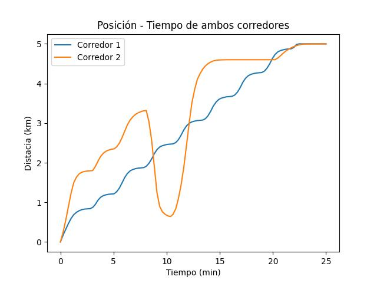
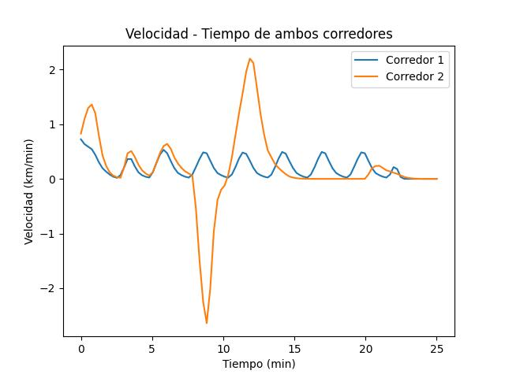

# Tarea 3: Análisis Cinemático de Corredores

**Autor**: Luis Fernando Núñez Rangel  
**Institución**: Facultad de Ciencias, UNAM  
**Asignatura**: Física Computacional

## Descripción General

Este proyecto implementa un sistema completo de análisis cinemático para datos experimentales de carrera. Combina procesamiento numérico en Fortran 90 con análisis y visualización en Python, demostrando la integración de múltiples herramientas computacionales en física experimental.

## Objetivos

1. Procesar datos experimentales de posición-tiempo de corredores
2. Calcular velocidades mediante diferenciación numérica
3. Analizar métricas de rendimiento deportivo
4. Visualizar resultados comparativos entre atletas

## Arquitectura del Sistema

### Pipeline de Procesamiento

```
Datos Experimentales (.dat)
         ↓
   [Fortran: Corredores.f90]
   - Lectura de datos
   - Diferenciación numérica (3 puntos)
   - Integración numérica (trapecio)
   - Cálculo de métricas
         ↓
   Datos Procesados (*_velocidad.dat)
         ↓
   [Python: tarea_3.ipynb]
   - Análisis estadístico
   - Visualización comparativa
         ↓
   Gráficas y Reportes
```

## Componentes del Sistema

### 1. Corredores.f90 - Motor de Procesamiento Numérico

#### Características Principales

**Entrada**:
- Archivos `.dat` con dos columnas: tiempo y distancia (orden indistinto)
- Detección automática de columnas mediante heurística

**Procesamiento**:
1. **Diferenciación numérica**: Método de 3 puntos de Lagrange
2. **Integración numérica**: Regla del trapecio acumulativa
3. **Análisis estadístico**: Velocidades extremas
4. **Métricas deportivas**: Tiempos parciales, pace por kilómetro

**Salida**:
- Archivo `*_velocidad.dat` con 4 columnas:
  - `tiempo_min`: Tiempo en minutos
  - `distancia_km`: Distancia en kilómetros
  - `v_km_per_min`: Velocidad en km/min
  - `v_m_per_s`: Velocidad en m/s
- Reporte en terminal con estadísticas

#### Fundamentos Numéricos

##### Diferenciación con Fórmulas de Lagrange (Malla No Uniforme)

Para malla irregular, se utiliza diferenciación de 3 puntos:

**Punto inicial (adelantada)**:
```
dy/dx|₀ = y₀(2x₀-x₁-x₂)/[(x₀-x₁)(x₀-x₂)] + y₁(x₀-x₂)/[(x₁-x₀)(x₁-x₂)] + y₂(x₀-x₁)/[(x₂-x₀)(x₂-x₁)]
```

**Puntos centrales**:
```
dy/dx|ᵢ = yᵢ₋₁(xᵢ-xᵢ₊₁)/[(xᵢ₋₁-xᵢ)(xᵢ₋₁-xᵢ₊₁)] + yᵢ(2xᵢ-xᵢ₋₁-xᵢ₊₁)/[(xᵢ-xᵢ₋₁)(xᵢ-xᵢ₊₁)] + yᵢ₊₁(xᵢ-xᵢ₋₁)/[(xᵢ₊₁-xᵢ₋₁)(xᵢ₊₁-xᵢ)]
```

**Punto final (atrasada)**:
```
dy/dx|ₙ = yₙ₋₂(xₙ-xₙ₋₁)/[(xₙ₋₂-xₙ₋₁)(xₙ₋₂-xₙ)] + yₙ₋₁(xₙ-xₙ₋₂)/[(xₙ₋₁-xₙ₋₂)(xₙ₋₁-xₙ)] + yₙ(2xₙ-xₙ₋₂-xₙ₋₁)/[(xₙ-xₙ₋₂)(xₙ-xₙ₋₁)]
```

**Ventajas**:
- Funciona con malla irregular
- Orden de precisión O(h²)
- Manejo de bordes sin perder precisión

##### Integración por Regla del Trapecio

Distancia acumulada integrando velocidad:

```
s(tᵢ) = s(tᵢ₋₁) + ½[v(tᵢ) + v(tᵢ₋₁)](tᵢ - tᵢ₋₁)
```

Permite verificar consistencia con datos originales.

#### Métricas Deportivas Calculadas

1. **Velocidad máxima y mínima** (con tiempos correspondientes)
2. **Tiempos parciales**: Tiempo para alcanzar 1, 2, 3, 4, 5 km
3. **Pace por kilómetro**: Tiempo invertido en cada kilómetro

#### Heurística de Detección de Columnas

```fortran
! Criterios de selección:
! 1. Solo una columna creciente → es tiempo
! 2. Ambas crecientes → la de menor rango es tiempo
!    (minutos suelen tener rango menor que kilómetros)
```

#### Compilación y Ejecución

```bash
# Compilar con optimización y estándar Fortran 2008
gfortran -O2 -std=f2008 -o bin/Corredores src/Corredores.f90

# Ejecutar con uno o más archivos
./bin/Corredores data/datos1n.dat data/datos2n.dat
```

#### Ejemplo de Salida

```
OK -> datos1n_velocidad.dat  ( 42 filas)
------------------------------------------------------------
Archivo: datos1n.dat
v_min =  1.12345E-01 km/min  |  1.87241E+00 m/s
v_max =  2.45678E-01 km/min  |  4.09463E+00 m/s
t(v_min)= 8.5000 min  | 8:30
t(v_max)= 2.3000 min  | 2:18
----- Tiempos (por integración de v) para alcanzar:
1 km:     3.2500 4:15
2 km:     7.8000 7:48
3 km:    12.1000 12:06
4 km:    16.5500 16:33
5 km:    21.2000 21:12
----- Pace por kilómetro (min:seg por km):
km 1:     3.2500 3:15
km 2:     4.5500 4:33
km 3:     4.3000 4:18
km 4:     4.4500 4:27
km 5:     4.6500 4:39
------------------------------------------------------------
```

### 2. tarea_3.ipynb - Análisis y Visualización

#### Funcionalidades

1. **Carga de datos**:
   ```python
   pd.read_csv("../data/datos1n.dat", sep='\\s+', names=["Distancia (km)", "Tiempo (m)"])
   ```

2. **Visualización comparativa**:
   - Gráfica Posición-Tiempo (ambos corredores)
   - Gráfica Velocidad-Tiempo (datos procesados)

3. **Análisis estadístico**:
   - Comparación de perfiles de velocidad
   - Identificación de fases de carrera
   - Análisis de resistencia (mantenimiento de velocidad)

#### Gráficas Generadas

**Posición vs Tiempo**:


**Velocidad vs Tiempo**:


#### Interpretación Física

Las gráficas permiten identificar:
- **Fase de aceleración inicial**: Pendiente creciente en v(t)
- **Fase de velocidad estable**: Meseta en v(t)
- **Fase de fatiga**: Decrecimiento en v(t)
- **Comparación entre atletas**: Estrategias de carrera

---

## Estructura del Directorio

```
tarea_3/
├── bin/
│   └── Corredores              # Ejecutable compilado
├── data/
│   ├── datos1n.dat             # Datos corredor 1 (original)
│   ├── datos1n_velocidad.dat   # Datos procesados corredor 1
│   ├── datos2n.dat             # Datos corredor 2 (original)
│   └── datos2n_velocidad.dat   # Datos procesados corredor 2
├── img/
│   ├── Posición.jpg            # Gráfica posición-tiempo
│   └── Velocidad.jpg           # Gráfica velocidad-tiempo
├── src/
│   ├── Corredores.f90          # Procesador numérico
│   ├── tarea_3.ipynb           # Análisis y visualización
│   └── Análisis.pdf            # Informe técnico
├── requirements.txt            # Dependencias Python
└── README.md                   # Esta documentación
```

## Requisitos del Sistema

### Compilador Fortran

- **gfortran** 9.0+ con soporte Fortran 2008
- Módulos intrínsecos: `iso_fortran_env`

### Entorno Python

- Python 3.8+
- Jupyter Notebook

### Dependencias Python

```bash
pip install -r requirements.txt
```

```
pandas>=1.1.0
matplotlib>=3.3.0
numpy>=1.19.0
```

## Flujo de Trabajo Completo

### Paso 1: Procesamiento de Datos

```bash
# Compilar el procesador
gfortran -O2 -std=f2008 -o bin/Corredores src/Corredores.f90

# Procesar archivos de datos
./bin/Corredores data/datos1n.dat data/datos2n.dat
```

**Salida**:
- `data/datos1n_velocidad.dat`
- `data/datos2n_velocidad.dat`
- Reporte estadístico en terminal

### Paso 2: Análisis Visual

```bash
# Abrir notebook de análisis
jupyter notebook src/tarea_3.ipynb
```

**Acciones en el notebook**:
1. Cargar datos originales y procesados
2. Generar gráficas comparativas
3. Analizar patrones de rendimiento

### Paso 3: Interpretación

Revisar:
- Estadísticas en terminal (velocidades extremas, paces)
- Gráficas en `img/`
- Informe técnico en `src/Análisis.pdf`

## Formato de Archivos de Datos

### Archivo de Entrada (.dat)

```
# Dos columnas (orden automático)
0.5    0.1     # tiempo[min]  distancia[km]
1.0    0.3     # o viceversa
1.5    0.6
...
```

**Requisitos**:
- Dos valores numéricos por línea (separados por espacios)
- Al menos una columna estrictamente creciente
- Líneas con formato incorrecto se ignoran

### Archivo de Salida (*_velocidad.dat)

```
# tiempo_min   distancia_km   v_km_per_min   v_m_per_s
  5.00000000E-01  1.00000000E-01  2.00000000E-01  3.33333333E+00
  1.00000000E+00  3.00000000E-01  4.00000000E-01  6.66666667E+00
  ...
```

**Formato**: Notación científica, 4 columnas, cabecera con comentario

## Validación y Verificación

### Pruebas Numéricas

1. **Conservación de distancia**:
   - Integrar velocidad debe reproducir distancia original
   - Tolerancia: < 1% de error

2. **Continuidad de velocidad**:
   - No debe haber saltos no físicos
   - Verificar suavidad de curva v(t)

3. **Consistencia física**:
   - Velocidades en rango humano razonable (0-30 km/h)
   - Aceleraciones no extremas

### Casos de Prueba

```bash
# Generar datos sintéticos
echo "0.0 0.0" > test.dat
echo "1.0 0.2" >> test.dat
echo "2.0 0.5" >> test.dat

./bin/Corredores test.dat
# Verificar velocidades calculadas
```

## Aplicaciones

### Deportivas

- Análisis de rendimiento en atletismo
- Estrategias de carrera (pacing)
- Detección de fatiga muscular
- Comparación entre atletas

### Científicas

- Estudio de biomecánica de la marcha
- Análisis de eficiencia energética
- Modelado de resistencia aeróbica
- Validación de modelos fisiológicos

### Educativas

- Enseñanza de métodos numéricos
- Aplicación de cálculo diferencial e integral
- Integración de herramientas computacionales
- Análisis de datos experimentales

## Mejoras Implementadas

### Robustez del Código

- Detección automática de formato de archivo
- Manejo de mallas no uniformes
- Validación de datos de entrada
- Formato de tiempo legible (mm:ss)

### Precisión Numérica

- Aritmética de doble precisión (`real64`)
- Método de 3 puntos para mayor precisión
- Manejo correcto de casos borde

### Usabilidad

- Procesamiento por lotes (múltiples archivos)
- Salida formateada y estructurada
- Reportes automáticos de métricas

## Limitaciones y Consideraciones

1. **Método de diferenciación**:
   - Requiere al menos 3 puntos de datos
   - Sensible a ruido en datos experimentales
   - Considerar suavizado previo si hay ruido

2. **Detección de columnas**:
   - Asume una columna estrictamente creciente
   - Puede fallar con datos desordenados

3. **Rango de validez**:
   - Optimizado para carreras cortas (< 10 km)
   - Tiempos en escala de minutos

## Referencias Técnicas

### Métodos Numéricos

1. **Diferenciación numérica**:
   - Burden & Faires (2010). *Numerical Analysis*, Cap. 4
   - Fornberg, B. (1988). "Generation of finite difference formulas on arbitrarily spaced grids". *Mathematics of Computation*

2. **Integración numérica**:
   - Press, W. H. et al. (2007). *Numerical Recipes*, Cap. 4
   - Atkinson, K. E. (1989). *An Introduction to Numerical Analysis*

### Física y Deportes

1. **Biomecánica**:
   - Winter, D. A. (2009). *Biomechanics and Motor Control of Human Movement*
   - Novacheck, T. F. (1998). "The biomechanics of running". *Gait & Posture*

2. **Fisiología del ejercicio**:
   - McArdle, W. D. et al. (2014). *Exercise Physiology: Energy, Nutrition, and Human Performance*

## Extensiones Futuras

- [ ] Implementar filtro de Savitzky-Golay para suavizado
- [ ] Agregar cálculo de aceleración (segunda derivada)
- [ ] Estimar gasto energético basado en velocidad
- [ ] Exportar resultados a formatos estándar (CSV, JSON)
- [ ] Interfaz gráfica para visualización interactiva
- [ ] Análisis estadístico avanzado (regresión, correlación)
- [ ] Detección automática de anomalías en datos
- [ ] Soporte para GPS tracking (formato GPX)

## Contribuciones

El código está diseñado para ser extensible. Áreas de mejora:
- Métodos de diferenciación adicionales (splines, FFT)
- Algoritmos de integración de mayor orden
- Visualizaciones 3D (posición-velocidad-tiempo)
- Machine learning para predicción de rendimiento

